<!-- JUDUL -->

  <h1 style="text-align: center; font-weight: bold">Praktikum 1 Praktek System Operasi</h1>
  <h3 style="text-align: center;">Dosen Pengampu : Dr. Ferry Astika Saputra, S.T., M.Sc.</h3>

 
<!-- END JUDUL -->

<!-- LOGO -->

  

<!-- END LOGO -->

<!-- MEMBER -->

  <h3 style="text-align: center;">Disusun Oleh :</h3>
  

    <em>Muhammad Eko Nur Sholeh (3123500003)</em> 
    <em>Ghaly Abrarian Putra (3123500018)</em> 
    <em>Muhammad Rasyid Rafif (3122500030)</em>
  

<!-- END MEMBER -->

<!-- K -->

  <h3 style="line-height: 1.3; font-weight: 600;">Politeknik Elektronika Negeri Surabaya Departemen Teknik Informatika Dan Komputer Program Studi Teknik Informatika 2023/2024</h3>
  

<!-- END K -->

<!-- DAFTAR ISI -->

  
## Daftar isi

1. [Daftar Isi](#daftar-isi)
2. [Pendahuluan](#pendahuluan)
3. [Sistematis Booting](#proses-booting)
4. [Soal Praktikum](#soal)
5. [Instalasi](#instalasi)
   - [Instalasi Virtual Machine](#instalasi-virtual-machine)
   - [Instalasi Debian 12 pada Virtual Machine](#instal-os)
6. [Kesimpulan](#kesimpulan)
7. [Refrensi](#referensi)

<!-- END DAFTAR ISI -->

<!-- KONTEN -->

### Pendahuluan

**Sistem Operasi** adalah perangkat lunak yang mengatur dan mengelola semua operasi dasar komputer, seperti menjalankan program, mengelola memori, dan menyediakan antarmuka pengguna. Ini merupakan fondasi dari pengoperasian setiap perangkat komputer modern.

### Proses Booting

**Proses booting** merupakan serangkaian tahap yang dilakukan sebuah perangkat elektronik saat pertama kali dinyalakan setelah mati total, pada tahap proses booting berlangsung perangkat akan mempersiapkan inisialisasi serta konfigurasi hardware juga mempersiapkan perangkat lunak (OS) yang akan di Jalankan.

Berikut merupakan langkah - langkah pada saat proses booting :

1. _Insialiasasi tegangan_ : pada tahap pertama power pada suatu laptop atau komputer akan standby dan menyalurkan tegangan rendah untuk persiapan langkah berikutnya.

 

     
   

2. _Power On_ : perangkat mengirim sinyal kepada front panel motherboard guna memngirimkan perintah menyalakan motherboard dan power mengirimkan tegangan kepada seluruh komponen.

 

     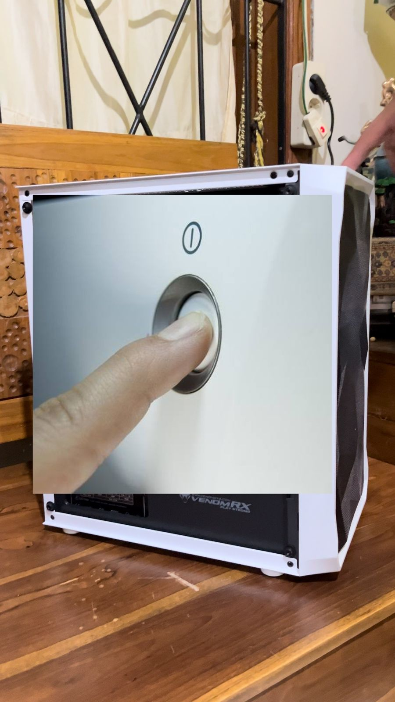
   

3. _Inisialisasi BIOS_ : Pada tahap ini BIOS yang tertanam pada motherboard akan mengatur sistem berjalannya POST , Setting Hardware hingga BOOT Prioritas.

 

     
   

4. _Post (Power-On Self-Test)_ : Perangkat akan melakukan testing awal pada perangkat kerasnya, di komputer mencakup processor ,ram , gpu , storage yang tertanam dan hardwdare lainnya yang tertancam, Namun biasanya tahap ini pada motherboard modern tidak ditampilkan dan diganti dengan showlogo, hal tersebut ditandai pada saat muncul logo produsen motherboardnya. akan tetapi sekalipun motherboard modern yang belum terInstall OS dan tidak memiliki prioritas boot Biasanya BIOS akan tetap menampilkan POST seperti pada gambar

  

     
   

5. _Boot Sector_ : Setelah tahap POST bios akan mengeksekusi prioritas BOOTING, sehingga pada tahap ini juga merupakan suatu tahap yang penting untuk penentuan manakah OS yang ingin dijalankan. semakin prioritas urutan maka OS yang di prioritaskan yang akan dijalankan.

  

     
   

6. _Loading Bootloader_ : bootloader merupakan sebuah proses dimana ketika storage penyimpanan memulai sebuah sistem operasi ke dalam memori (RAM).

     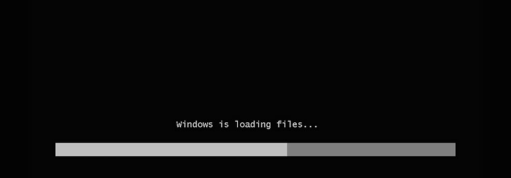
   

7. _Loading Kernel_ : merupakan sebuah tahap dimana sistem operasi secara aktif mulai memasuki tahap berikutnya (inisialisai sistem)

     
   

8. _Init Proses_ : setelah kernel dimuat, sistem opereasi akan melakukan insialisasi. memuat layanan sistem, mengatur konfigurasi jaringan, mempersiapkan environment user.

     
   

9. _GUI_ : render tampilan antarmuka grafis serta masuk kedalam sistem.

     
   

### SOAL

laporankan hasil pengerjaan sebuah instalisasi debian 12 menggunakan virtual machine (VMbox) dengan syarat :

- Setting CPU usage : 2 Core
- Setting Ram : 4096MB / 4GB
- HDD 25GB dengan partisi :
  / : 20GB
  /storage : 5GB
  /swap :1.5GB

### Instalasi

##### Instalasi Virtual Machine

1. Kunjungi website resmi Virtual Box (https://www.virtualbox.org/wiki/Downloads)

   

     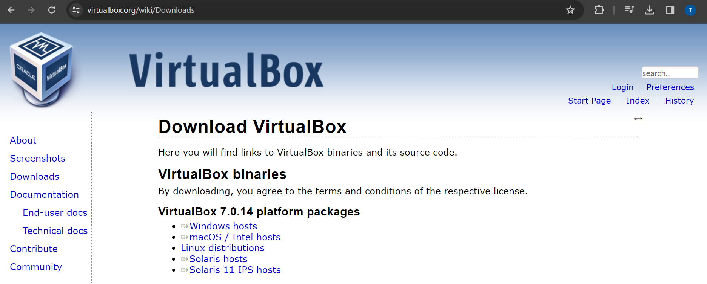
   

2. Pilih versi VM packages yang sesuai dengan OS yang sekarang dijalankan dan tekan versi maka file Virtual box akan otomatis ter-download.

   

     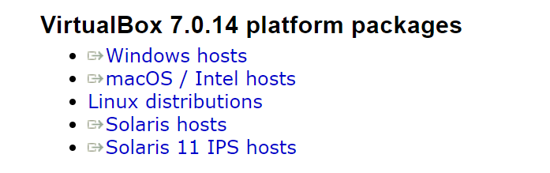
   

3. Tunggu Download file hingga selesai.

   

     
   

4. Buka File Aplikasi VirtualBox.exe (pada windows) yang telah didownload tadi

   

     
   

5. Setelah aplikasi telah terbuka bisa Klik **"Next"**

   

     
   

6. Setup instalasi & Klik **"Next"**

   

     
   

7. Pada tahap warning network interface Klik **"YES"**

   

     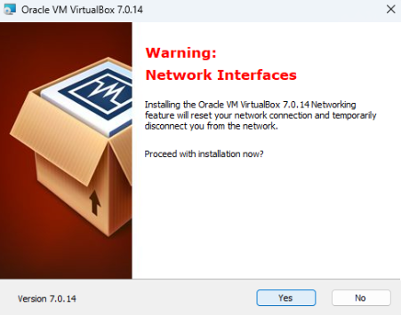
   

8. Pada tahap missing dependencies klik **"YES"**

   

     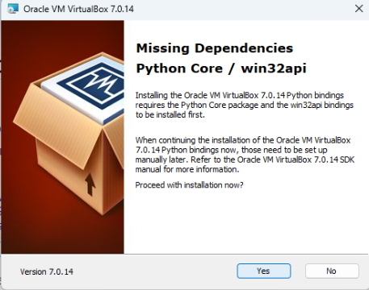
   

9. Pada tahap siap install Klik **"Instal"**

   

     
   

10. Tunggu proses intalasi aplikasi hingga **selesai**

    

      
    

11. Setelah proses install selesai centang pada 'Start Virtual machine'

    

      
    

### instalasi os

1. Download ISO Debian 12 dari [website resmi Debian](https://www.debian.org/download)
   

     
   

2. Masuk ke tampilan VirtualBox dan klik **"New"**
   

     
   

3. Masukkan nama "BEBAS" (Debian12), sesuaikan Type dan versi Debian sesuai arsitektur CPU, lalu klik **"Next"**
   

     
   

4. Alokasikan CPU & RAM Usage sesuai arahan (4096MB RAM & 2 CORE CPU)
   

     
   

5. Alokasikan Storage sebesar 25GB (akan otomatis menjadi 26GB) dan klik **"Next"**
   

     
   

6. Pada summary / preview, klik **"Finish"**
   

     
   

7. Pada tampilan utama, arahkan ke tools yang sudah dibuat dan klik **"Settings"**
   

     
   

8. Pada bagian General, ubah Shared Clipboard menjadi bidirectional
   

     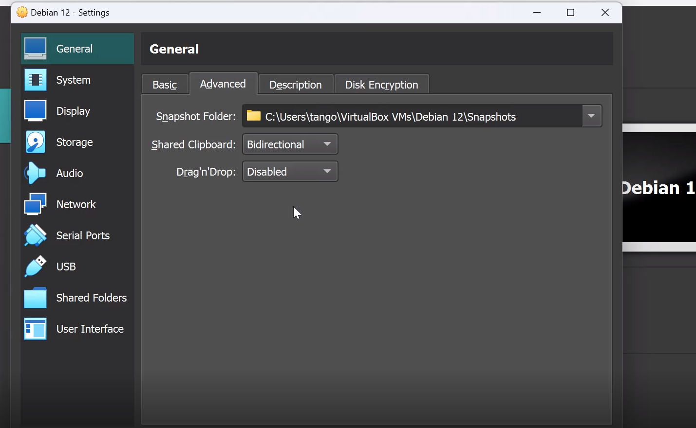
   

9. Pada Display, atur video memory sebaik mungkin
   

     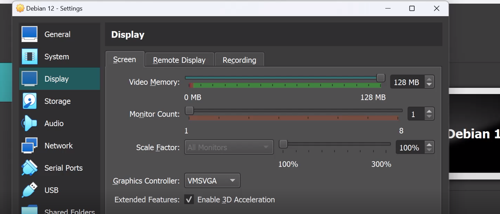
   

10. Pada Storage > Empty, cari ISO yang sudah diunduh
    

      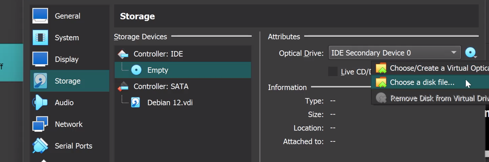
    

11. Setelah menyetel, kembali ke halaman utama dan klik **"Start"**
    

      
    

12. Setelah terbuka, tekan Enter pada **"Graphical Install"**
    

      
    

13. Pilih bahasa yang diinginkan dan klik **"Continue"**
    

      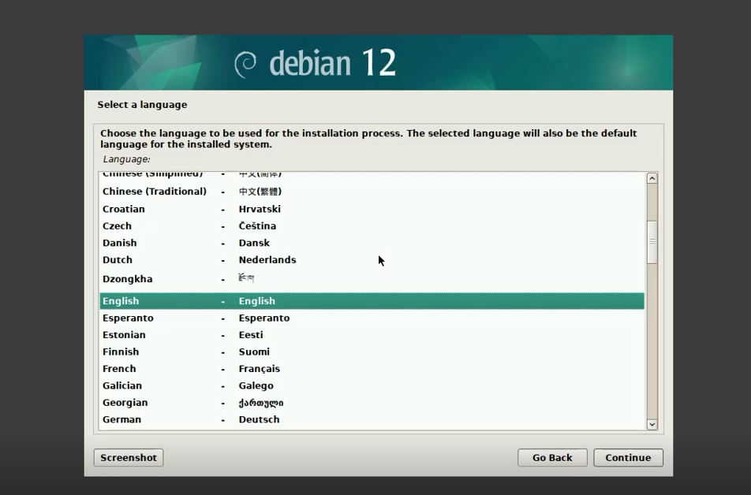
    

14. Pilih lokasi yang diinginkan dan klik **"Continue"**
    

      
    

15. Pilih layout keyboard yang diinginkan dan klik **"Continue"**
    

      
    

16. Tunggu proses persiapan
    

      
    

17. Masukkan hostname sesuai saran Administrator Protocol dan klik **"Continue"**
    

      
    

18. Masukkan Password sesuai keinginan dan klik **"Continue"**
    

      
    

19. Masukkan User account sesuai keinginan dan klik **"Continue"** dan tunggu prosesnya
    

      
    

20. Pilih partisi disk yang sudah dibuat dan klik **"Continue"**
    

      
    

21. Pilih "All files in one partition"
    

      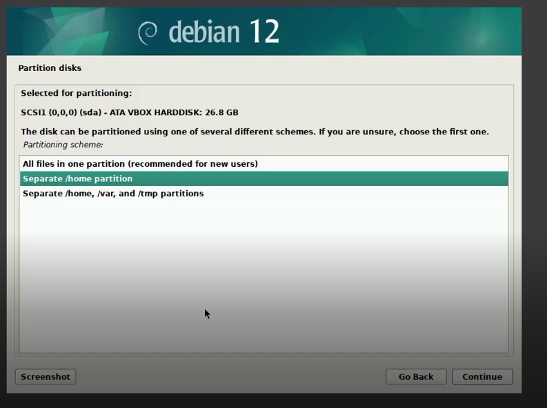
    

22. Pilih "Primary" untuk / dan klik **"Continue"**
    

      
    

23. Masukkan / (20GB) dan klik **"Continue"**
    

      
    

24. Pilih Ext4 untuk / dan klik **"Continue"**
    

      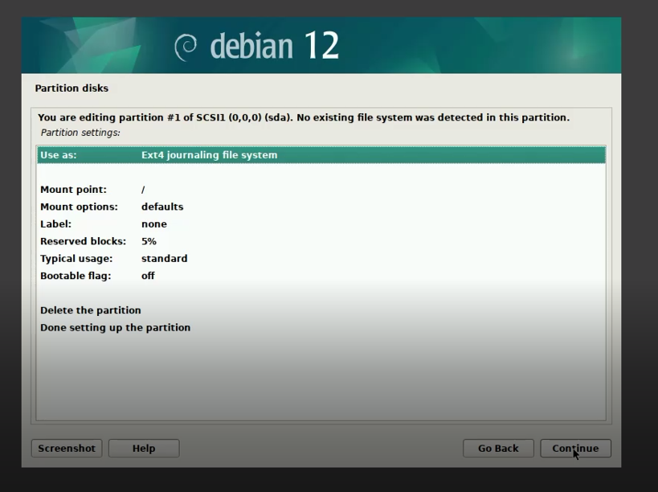
    

25. Klik "Done setting up the partition" dan **"Continue"**
    

      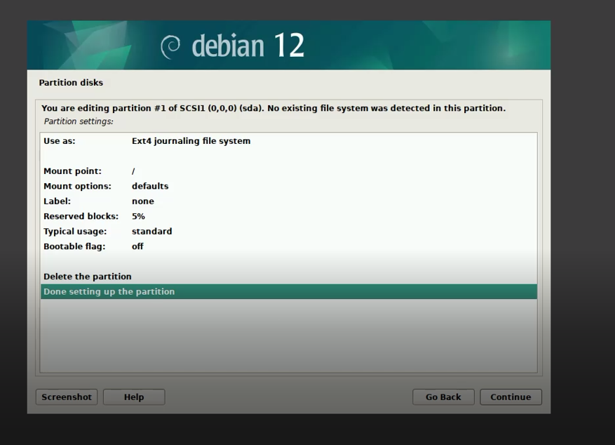
    

26. Lakukan hal yang sama untuk partisi yang belum dibagi dan klik **"Continue"**
    

      
    

27. Klik "Create a new partition" dan **"Continue"**
    

      
    

28. Masukkan ukuran 5GB untuk /Storage dan klik **"Continue"**
    

      
    

29. Pilih "Primary" untuk /Storage dan klik **"Continue"**
    

      
    

30. Klik "Beginning" dan **"Continue"**
    

      
    

31. Pilih ext4 dan ubah Mount point menjadi /Storage, klik **"Continue"**
    

      
    

32. Pilih partisi yang belum diinisialisasi, klik **"Continue"**
    

      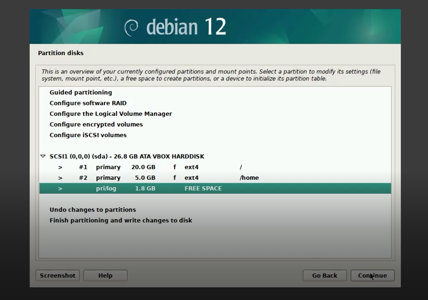
    

33. Klik "Create a new partition" dan **"Continue"**
    

      
    

34. Masukkan ukuran 1.5GB untuk SWAP dan klik **"Continue"**
    

      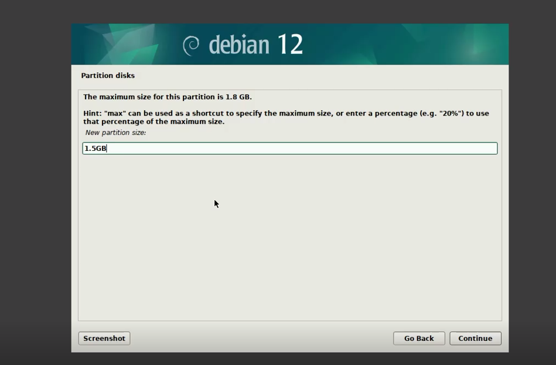
    

35. Pilih "Logical" dan klik **"Continue"**
    

      
    

36. Klik "Beginning" dan **"Continue"**
    

      
    

37. Pilih "Use as" dan klik **"Continue"**
    

      
    

38. Pilih "SWAP" untuk "Use as" dan klik **"Continue"**
    

      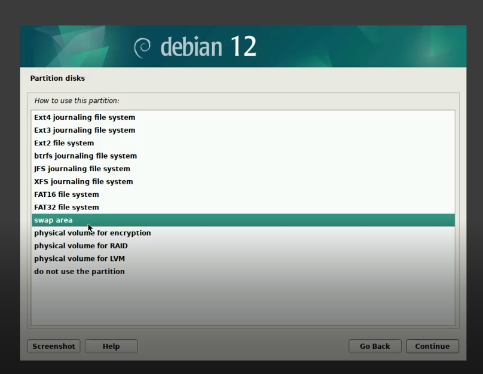
    

39. Klik "Done setting up the partition" dan **"Continue"**
    

      
    

40. Pilih "Finish partitioning and write changes to disk" dan **"Continue"**
    

      
    

41. Pilih "Yes" dan klik **"Continue"** pada pertanyaan write the changes to disk
    

      
    

42. Pilih "No" pada scan Extra installation media
    

      
    

43. Pilih "Configure the package manager" country menjadi "Indonesia" dan klik **"Continue"**
    

      
    

44. Pilih Debian archive mirror ke "Kebo.pens.ac.id" dan klik **"Continue"**
    

      
    

45. Kosongkan bagian http proxy dan klik **"Continue"**
    

      
    

46. Pada tahap configuring popularity, pilih NO dan klik **"Continue"**
    

      
    

47. Tunggu proses instalasi
    

      
    

48. Pilih "Yes" pada pertanyaan apakah install GRUB dan klik **"Continue"**
    

      
    

49. Tunggu instalasi GRUB hingga selesai
    

      
    

50. Pilih bootloader GRUB pada device awal yang telah dibuat
    

      
    

51. Pada permintaan reboot, klik **"Continue"**
    

      
    

52. Dan akhirnya, OS Linux Debian 12 Anda siap digunakan!
    

      
    

## Kesimpulan

setelah praktikum Percobaan instal debian pada virtualbox menjadikan mahasiswa paham bagaimana cara menginstall OS pada VM (Virtual Machine) & Memberikan wawasan tentang konsep sederhana jalannya Operating Sistem selain itu, hal yang menarik ialah bahwa sistem operasi (OS) dapat berjalan baik melalui boot langsung pada BIOS/UEFI atau melalui lingkungan virtual seperti mesin virtual (VM). sebagai Contohnya adalah Oracle Virtualbox ini, bisa menjalankan Debian. mungkin bila di Machintos (MacOS) ada windows Pararel yang dapat menjalankan OS windows pada macbook / iMac dengan menggunakan Virtual Machine. sehingga dapat kita simpulkan yaitu intinya OS adalah suatu perangkat lunak yang sangat diperlukan pada keberlangsungan fungsi suatu barang elektronik.

### Referensi

Buku 'Operating System Concepts' [🔗](https://os.ecci.ucr.ac.cr/slides/Abraham-Silberschatz-Operating-System-Concepts-10th-2018.pdf)

Mengenal debian oleh telkom university [🔗](https://it.telkomuniversity.ac.id/mengenal-debian-os-sejarah-kelebihan-dan-kekurangan/)

Apa itu Virtual Box oleh jagongoding[🔗](https://jagongoding.com/others/apa-itu-virtual-box/)

Install virtual box oleh solmet kemendikbud [🔗](https://solmet.kemdikbud.go.id/?p=2660)

Link Download Debian [🔗](https://www.debian.org/download)

Link Virtual Box[🔗](https://www.virtualbox.org/)

Video Tutorail How to Download & Instal debian 12 on VirtualBox[🔗](https://www.youtube.com/watch?v=zfOWKG2QPB0)

