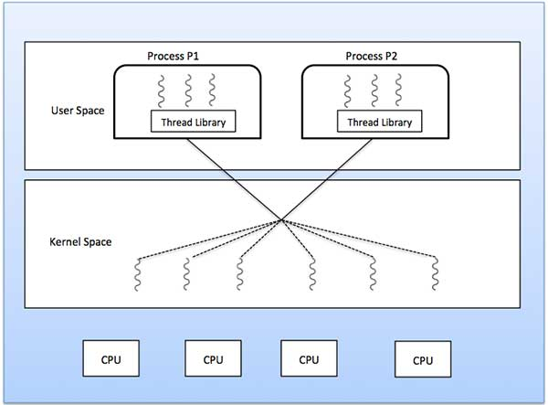

  <h1 class="text-align: center;font-weight: bold">Praktikum 10 Praktek System Operasi</h1>
  <h3 class="text-align: center;">Dosen Pengampu : Dr. Ferry Astika Saputra, S.T., M.Sc.</h3>

 

  
  

  <h3 style="text-align: center;">Disusun Oleh :</h3>
  

    <em>Muhammad Eko Nur Sholeh (3123500003)</em> 
    <em>Ghaly Abrarian Putra (3123500018)</em> 
    <em>Muhammad Rasyid Rafif (3122500030)</em>
  

<h3 style="text-align: center;line-height: 1.5">Politeknik Elektronika Negeri Surabaya Departemen Teknik Informatika Dan Komputer Program Studi Teknik Informatika 2023/2024</h3>
  

## THREADS

Thread adalah unit dasar dari pemanfaatan CPU dan merupakan komponen penting dalam sistem komputer multithreaded. Setiap thread dalam sebuah proses berbagi sumber daya yang sama seperti memori dan file, tetapi memiliki register dan stack sendiri.

#### Arsitektur MultiThread

Dalam arsitektur server multithread, server dapat menangani banyak permintaan klien secara bersamaan dengan membuat thread terpisah untuk setiap permintaan. Contohnya adalah web server yang menciptakan thread baru untuk setiap permintaan HTTP.

#### Keuntungan/Benefit Menggunakan Multithreading

Penggunaan multithreading dalam pemrograman menawarkan berbagai keuntungan yang signifikan, terutama dalam hal kinerja dan efisiensi. Berikut adalah beberapa keuntungan utama menggunakan multithreading:

1. Responsiveness
   Penjelasan: Dalam aplikasi dengan antarmuka pengguna (GUI), multithreading memungkinkan aplikasi tetap responsif meskipun sebagian dari aplikasi mengalami blokir atau sedang menjalankan operasi yang memakan waktu lama.
   Contoh: Pada aplikasi pengolah kata, satu thread bisa menangani input pengguna dan antarmuka pengguna, sementara thread lain menangani penyimpanan otomatis atau operasi latar belakang lainnya. Ini memastikan antarmuka tetap responsif terhadap tindakan pengguna.
2. Resource Sharing
   Penjelasan: Thread dalam satu proses berbagi memori dan sumber daya yang sama, seperti variabel global dan file yang dibuka. Ini membuat komunikasi antar thread lebih efisien dibandingkan komunikasi antar proses yang memerlukan mekanisme inter-proces communication (IPC) seperti shared memory atau message passing.
   Contoh: Pada server web, beberapa thread bisa berbagi cache data atau koneksi database yang sama, yang mengurangi overhead dan meningkatkan efisiensi.
3. Economy
   Penjelasan: Membuat dan mengelola thread lebih murah daripada membuat dan mengelola proses. Ini karena thread dalam proses yang sama berbagi banyak sumber daya, termasuk memori dan tabel file, yang mengurangi overhead yang terkait dengan pembuatan dan pengelolaan proses.
   Contoh: Pada aplikasi server, menggunakan thread untuk menangani permintaan klien lebih efisien dalam hal penggunaan memori dan waktu pemrosesan dibandingkan membuat proses baru untuk setiap permintaan klien.
4. Scalability
   Penjelasan: Thread memungkinkan aplikasi untuk memanfaatkan arsitektur multiprosesor atau multicore dengan lebih baik. Aplikasi multithreaded dapat menjalankan thread yang berbeda pada prosesor atau core yang berbeda secara simultan, meningkatkan throughput dan kinerja aplikasi secara keseluruhan.
   Contoh: Pada aplikasi ilmiah atau teknik yang membutuhkan banyak perhitungan, pekerjaan dapat dibagi menjadi beberapa thread yang dijalankan secara paralel pada berbagai core prosesor, sehingga mempercepat penyelesaian tugas.

#### Multicore Programming

Multicore atau multiprosesor menambahkan tantangan baru seperti:

- Dividing Activities: Memecah tugas-tugas menjadi bagian-bagian yang dapat berjalan secara paralel.
  Balance: Menjaga keseimbangan beban kerja di antara core-core.
- Data Splitting: Memisahkan data sehingga dapat diproses secara paralel.
- Data Dependency: Mengelola ketergantungan data antar thread.
- Testing and Debugging: Menguji dan debugging program yang berjalan secara paralel lebih kompleks.

Paralelisme memungkinkan suatu sistem untuk menjalankan banyak tugas secara bersamaan, sedangkan konkurensi memungkinkan banyak tugas untuk berjalan secara bersamaan, meskipun hanya ada satu prosesor.

#### Multithreading Models

- Many-to-One: Banyak thread pengguna dipetakan ke satu thread kernel. Model ini tidak mendukung paralelisme pada sistem multicore karena hanya satu thread yang dapat berjalan di kernel pada satu waktu.
- Many-to-Many: Banyak thread pengguna dipetakan ke banyak thread kernel. Model ini memungkinkan lebih fleksibel dan efisien dalam mengelola thread.
- One-to-One: Setiap thread pengguna dipetakan ke satu thread kernel. Model ini mendukung paralelisme tetapi bisa mahal karena setiap thread pengguna membutuhkan thread kernel.

#### Thread Library

- User-level Library: Dijalankan di ruang pengguna tanpa dukungan dari kernel.
- Kernel-level Library: Didukung langsung oleh kernel, sehingga memungkinkan thread pengguna untuk dipetakan ke thread kernel.

#### Pthreads

Adalah aturan baku untuk membuat dan mengelola thread pada sistem operasi UNIX seperti Solaris, Linux, dan Mac OS X. Thread adalah unit eksekusi mandiri dalam sebuah program, memungkinkan program untuk menjalankan beberapa tugas secara bersamaan.Implementasi Pthreads dapat dilakukan di level pengguna (user-level) atau di level kernel (kernel-level).

#### Windows Thread

menyediakan mekanisme untuk membuat dan mengelola thread. Setiap thread memiliki identitas unik (ID), kumpulan register, dan stack memori yang terpisah.

#### Java Thread

Dikelola oleh Java Virtual Machine (JVM) dan biasanya menggunakan model thread dari sistem operasi yang mendasarinya. Thread Java dapat dibuat dengan memperluas kelas Thread atau mengimplementasikan antarmuka Runnable.

#### Thread Implisit

Thread implisit merujuk pada teknik di mana pembuatan dan pengelolaan thread dilakukan oleh kompiler dan pustaka runtime, bukan oleh programmer secara eksplisit. Pendekatan ini bertujuan untuk menyederhanakan pemrograman paralel dengan mengurangi kompleksitas yang terkait dengan manajemen thread secara manual. Berikut adalah beberapa contoh metode yang menggunakan thread implisit:

#### 1. Thread Pools

- **Konsep**: Thread pool adalah kumpulan thread yang telah dibuat sebelumnya dan siap untuk menjalankan tugas. Ketika ada tugas baru yang harus dijalankan, tugas tersebut diambil oleh salah satu thread dalam pool, yang sudah siap bekerja.
- **Keuntungan**:
  - **Efisiensi**: Penggunaan kembali thread yang ada lebih efisien daripada membuat thread baru setiap kali ada tugas baru. Ini mengurangi overhead pembuatan dan penghancuran thread.
  - **Pengelolaan Beban Kerja**: Thread pool dapat mengatur jumlah maksimum thread yang berjalan secara bersamaan, yang membantu dalam pengelolaan sumber daya sistem dan pencegahan oversubscription.
- **Implementasi**: Banyak bahasa pemrograman dan pustaka menyediakan implementasi thread pool, seperti `java.util.concurrent.ExecutorService` di Java dan `ThreadPoolExecutor` di Python.

#### 2. OpenMP

- **Konsep**: OpenMP (Open Multi-Processing) adalah standar untuk pemrograman paralel di lingkungan memori bersama. OpenMP menggunakan kumpulan direktif kompiler, pustaka runtime, dan variabel lingkungan untuk mengelola eksekusi paralel.
- **Keuntungan**:
  - **Kemudahan Penggunaan**: Programmer dapat menambahkan direktif OpenMP ke kode sekuensial untuk menjadikannya paralel tanpa perlu mengubah struktur kode secara signifikan.
  - **Kontrol Granularitas**: OpenMP memungkinkan kontrol granularitas pada level loop dan bagian kode lainnya, mempermudah pembagian tugas dalam blok kode.
- **Implementasi**: OpenMP didukung oleh banyak kompiler utama, seperti GCC, Clang, dan Intel compilers. Contoh direktif OpenMP adalah `#pragma omp parallel for`, yang memparallelkan eksekusi loop.

#### 3. Grand Central Dispatch (GCD)

- **Konsep**: GCD adalah teknologi dari Apple yang digunakan pada macOS dan iOS untuk memudahkan identifikasi dan pengelolaan bagian kode yang dapat dijalankan secara paralel. GCD menggunakan konsep `dispatch queues` untuk mengelola eksekusi tugas.
- **Keuntungan**:
  - **Sederhana dan Efisien**: GCD menyederhanakan pemrograman paralel dengan mengabstraksi manajemen thread. Programmer hanya perlu menambahkan tugas ke antrian yang sesuai, dan GCD mengurus eksekusinya.
  - **Penskalaan Otomatis**: GCD secara otomatis menyesuaikan jumlah thread berdasarkan beban kerja dan sumber daya yang tersedia, sehingga optimal dalam penggunaan CPU.
- **Implementasi**: GCD menggunakan dua jenis antrian, yaitu **serial queues** dan **concurrent queues**. Tugas dapat ditambahkan ke antrian ini menggunakan fungsi seperti `dispatch_async` untuk eksekusi asinkron.

### Threading Issues

Dalam sistem operasi, pengelolaan thread memerlukan perhatian khusus terhadap beberapa isu utama, yang mencakup semantik dari panggilan sistem `fork()` dan `exec()`, penanganan sinyal, pembatalan thread, penyimpanan thread-lokal, dan aktivasi penjadwal. Berikut adalah penjelasan rinci mengenai setiap isu tersebut:

#### Semantics of `fork()` and `exec()` System Calls

- **`fork()`**: `fork()` adalah panggilan sistem yang digunakan untuk membuat proses baru dengan menggandakan proses yang memanggilnya. Dalam konteks multithreading:
  - **Menggandakan Satu Thread**: Hanya thread yang memanggil `fork()` yang digandakan dalam proses anak. Ini berarti thread lain di proses induk tidak ada di proses anak, yang bisa menyebabkan masalah jika thread lain memegang sumber daya penting atau mengelola data yang dibutuhkan proses anak.
  - **Menggandakan Semua Thread**: Semua thread dalam proses induk digandakan di proses anak. Pendekatan ini lebih rumit karena memastikan konsistensi dan sinkronisasi antara thread yang digandakan dapat menjadi tantangan besar.
- **`exec()`**: `exec()` menggantikan proses yang sedang berjalan dengan program baru. Ketika `exec()` dipanggil:
  - Semua thread dalam proses digantikan oleh program baru, yang dimulai dengan satu thread utama. Semua thread sebelumnya dihentikan, dan konteks eksekusi baru dimulai dari awal program yang dieksekusi.

#### Signal Handling

- **Sinyal**: Sinyal adalah metode yang digunakan oleh sistem operasi untuk mengirim pemberitahuan ke proses tentang kejadian tertentu (misalnya, pembagian dengan nol, permintaan penghentian).
- **Dalam Sistem Multithreaded**: Penanganan sinyal lebih rumit karena sinyal dapat ditujukan ke:
  - **Thread Tertentu**: Sinyal hanya diterima oleh thread yang spesifik.
  - **Semua Thread**: Sinyal dikirim ke semua thread dalam proses, meskipun hanya satu thread yang akan menangani sinyal tersebut.
  - **Thread-thread Tertentu**: Sinyal dikirim ke beberapa thread tertentu yang telah mengatur untuk menangani sinyal tersebut. Hal ini memerlukan mekanisme koordinasi untuk menentukan thread mana yang akan menangani sinyal.

#### Thread Cancellation

- **Pembatalan Thread**: Proses penghentian thread sebelum selesai menjalankan tugasnya. Ini bisa dilakukan untuk membebaskan sumber daya atau menghentikan eksekusi yang tidak lagi diperlukan.
- **Pendekatan Utama**:
  - **Pembatalan Asinkron**: Thread dapat dibatalkan kapan saja, tanpa pemberitahuan. Ini bisa menyebabkan masalah inkonsistensi data atau deadlock karena thread bisa dibatalkan saat sedang memegang sumber daya penting.
  - **Pembatalan Tertunda**: Thread memeriksa secara berkala apakah ada permintaan pembatalan dan membatalkan diri secara teratur pada titik-titik tertentu yang aman. Pendekatan ini lebih aman karena thread memiliki kesempatan untuk membersihkan sumber daya sebelum berhenti.

#### Thread-Local Storage (TLS)

- **Penyimpanan Lokal Thread**: Mekanisme yang memungkinkan setiap thread memiliki salinan data sendiri yang bersifat unik untuk thread tersebut.
- **Kegunaan**: TLS sangat berguna ketika data perlu bersifat thread-specific dan tidak aman untuk diakses oleh thread lain. Misalnya, variabel yang menyimpan informasi sesi untuk setiap thread klien di server web.

#### Scheduler Activations

- **Aktivasi Penjadwal**: Model komunikasi antara thread pengguna dan kernel untuk mengelola thread secara efisien dalam model Many-to-Many atau two-level.
- **Lightweight Process (LWP)**: Struktur data menengah yang digunakan untuk mengurangi overhead penjadwalan dan memungkinkan kernel dan perpustakaan thread berkomunikasi.
- **Mekanisme Aktivasi Penjadwal**: Ketika kernel memutuskan untuk menjadwalkan atau menghentikan thread pengguna, ia mengirim aktivasi penjadwal ke perpustakaan thread pengguna, yang kemudian dapat menyesuaikan peta thread pengguna ke thread kernel. Hal ini memungkinkan perpustakaan thread untuk menjaga sinkronisasi dan efisiensi dalam penggunaan thread kernel.

#### QNA

1. Berikan tiga contoh pemrograman di mana multithreading memberikan kinerja yang lebih baik daripada solusi single-threaded.
   Jawaban:
   a. Server web yang melayani setiap permintaan dalam thread terpisah.
   b. Aplikasi paralel seperti perkalian matriks di mana bagian-bagian matriks dapat dikerjakan secara paralel.
   c. Program GUI interaktif seperti debugger di mana satu thread digunakan untuk memonitor input pengguna, thread lain mewakili aplikasi yang berjalan, dan thread ketiga memonitor kinerja.

2. Apa dua perbedaan antara thread tingkat pengguna dan thread tingkat kernel? Dalam keadaan apa satu jenis lebih baik dari yang lain?
   Jawaban:
   a. Thread tingkat pengguna tidak diketahui oleh kernel, sedangkan kernel mengetahui thread kernel.
   b. Pada sistem yang menggunakan pemetaan M:1 atau M:N, thread pengguna dijadwalkan oleh pustaka thread dan kernel menjadwalkan thread kernel.
   c. Thread kernel tidak harus dikaitkan dengan proses sedangkan setiap thread pengguna milik suatu proses. Thread kernel umumnya lebih mahal untuk dipelihara daripada thread pengguna karena harus diwakili dengan struktur data kernel.

3. Jelaskan tindakan yang diambil oleh kernel untuk context-switch antara thread tingkat kernel.
   Jawaban:
   Context switching antara thread kernel biasanya memerlukan penyimpanan nilai register CPU dari thread yang sedang ditukar dan pemulihan register CPU dari thread baru yang dijadwalkan.
