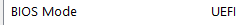
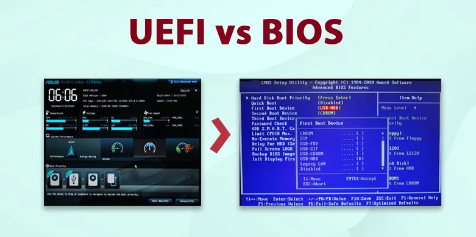

  <h1 class="text-align: center;font-weight: bold">Praktikum 2 Praktek System Operasi</h1>
  <h3 class="text-align: center;">Dosen Pengampu : Dr. Ferry Astika Saputra, S.T., M.Sc.</h3>

 

  
  

  <h3 style="text-align: center;">Disusun Oleh :</h3>
  

    <em>Muhammad Eko Nur Sholeh (3123500003)</em> 
    <em>Ghaly Abrarian Putra (3123500018)</em> 
    <em>Muhammad Rasyid Rafif (3122500030)</em>
  

<h3 style="text-align: center;line-height: 1.5">Politeknik Elektronika Negeri Surabaya Departemen Teknik Informatika Dan Komputer Program Studi Teknik Informatika 2023/2024</h3>
  

## Daftar Isi

1. [Pendahuluan](#pendahuluan)
2. [Legacy & UEFI](#legacy-dan-uefi)
   - [Detail Legacy](#legacy)
   - [Detail Uefi](#uefi)
3. [Perbedaan Legacy dan UEFI](#perbedaan-legacy-dan-uefi)
4. [Referensi](#referensi)

## Pengertian BIOS

BIOS merupakan singkatan dari Basic Input Output System. merupakan suatu software (ditulis dalam bahasa assembly) yang mengatur fungsi dasar dari perangkat keras (hardware) komputer. BIOS tertanam dalam sebuah chip memory (ROM ataupun Flash Memory) berbahan Comlpimentari Metal Oxide Semiconductor (CMOS) yang terdapat pada motherboard. Sebuah baterai yang biasa disebut sebagai baterai CMOS berfungsi untuk menjaga agar tanggal dan settingan lainnya yang telah kita set pada BIOS tidak hilang atau kembali ke konfigurasi awal meskipun komputer dimatikan.

## Legacy Dan UEFI

### Legacy

Legacy BIOS (Basic Input/Output System) adalah sistem firmware tradisional yang digunakan pada sebagian besar komputer pribadi sebelum diperkenalkannya UEFI (Unified Extensible Firmware Interface). Berikut adalah beberapa poin singkat mengenai Legacy BIOS:

**Tanggal Rilis:**

- Legacy BIOS telah ada sejak awal perkembangan komputer pribadi dan menjadi standar untuk menginisialisasi perangkat keras dan memulai sistem operasi.

**Fungsi Utama:**

- Legacy BIOS bertanggung jawab untuk melakukan inisialisasi perangkat keras dasar, mengatur urutan boot, dan memungkinkan komunikasi antara perangkat keras dan sistem operasi.

**Kekurangan:**

- Legacy BIOS memiliki beberapa keterbatasan atau kekurangan, seperti dukungan terbatas untuk drive berkapasitas besar, boot time yang lambat, dan kurangnya antarmuka pengelolaan yang canggih.

**Antarmuka Pengguna:**

- Tidak seperti antarmuka grafis modern, Legacy BIOS menggunakan antarmuka teks sederhana yang memungkinkan pengguna untuk mengonfigurasi pengaturan dasar sistem.

**Mode Legacy:**

- Banyak sistem modern masih mendukung mode Legacy untuk kompatibilitas dengan perangkat lunak atau perangkat keras yang dibuat untuk bekerja dengan Legacy BIOS.

Meskipun Legacy BIOS masih digunakan pada beberapa sistem, sebagian besar komputer modern telah beralih ke UEFI untuk mendukung kebutuhan yang lebih canggih dan meningkatkan performa sistem.

### UEFI

UEFI, atau Unified Extensible Firmware Interface, adalah sebuah standar antarmuka firmware yang menggantikan Legacy BIOS pada banyak sistem komputer modern. Berikut adalah beberapa poin singkat tentang UEFI:

1. **Tanggal Rilis:**

   - UEFI diperkenalkan sebagai pengganti Legacy BIOS dan mulai berkembang pada awal tahun 2000-an. Penerapan UEFI secara luas terjadi seiring berjalannya waktu.

2. **Fungsi Utama:**

   - UEFI memiliki fungsi yang serupa dengan Legacy BIOS, yaitu inisialisasi perangkat keras dan memulai sistem operasi. Namun, UEFI juga menyediakan fitur-fitur tambahan, seperti antarmuka pengelolaan yang lebih canggih dan kemampuan boot yang lebih fleksibel.

3. **Antarmuka Pengguna:**

   - UEFI mendukung antarmuka pengguna grafis yang lebih canggih dan memungkinkan konfigurasi sistem dengan lebih mudah melalui mouse dan tampilan grafis.

4. **Keamanan Lebih Baik:**

   - UEFI menyediakan lapisan keamanan yang lebih baik daripada Legacy BIOS. Secure Boot, sebuah fitur yang memverifikasi integritas kode boot, adalah salah satu contohnya.

5. **Dukungan untuk GPT:**

   - UEFI mendukung skema partisi GPT (GUID Partition Table), yang memungkinkan penggunaan drive berkapasitas besar dan lebih banyak partisi.

6. **Boot Lebih Cepat:**

   - UEFI dapat memberikan waktu boot yang lebih cepat dibandingkan dengan Legacy BIOS, karena proses inisialisasi dan booting dapat dilakukan secara paralel.

7. **Fleksibilitas Boot:**
   - UEFI mendukung boot dari berbagai sumber, termasuk drive internal, USB, dan jaringan, memberikan fleksibilitas yang lebih besar dalam konfigurasi sistem.

Seiring dengan kemajuan teknologi, UEFI menjadi standar pada sebagian besar komputer modern dan memberikan sejumlah keuntungan dibandingkan dengan pendahulunya, Legacy BIOS.

## Perbedaan Legacy dan UEFI

**1. Definisi**
(UEFI) suatu proses booting pada komputer modern dengan kemampuan lebih canggih dibanding sistem Legacy. UEFI menggunakan firmware untuk menyimpan EFI Service Partitions saat proses booting berlangsung.

_Sementara_, Legacy adalah proses booting komputer dengan firmware BIOS yang lebih lama dan tradisional.

_Motherboard modern pada umumnya menggunakan firmware bios UEFI sedangkan motherboard lama biasanya menggunakan bios mode LEGACY._

**2. Antarmuka**
UEFI mendukung penggunaan mouse bahkan touchscreen atau layar sentuh pada sistem setting BIOS sedangkan Legacy hanya support keyboard saja.

**3. Kapasitas**
UEFI mendukung kapasitas hardisk bisa lebih dari 2 TB sedangkan bios Legacy hanya 2 TB adalah kapasitas maksimal , artinya tidak bisa lebih dari 2 TB. dan biasanya Legacy menggunakan skema MBR (Master Boot Record) sedangkan UEFI menggunakan skema GPT (GUID Partition Table), namun pada motherboard modern bila hardisk yang kita miliki adalah skema booting MBR maka jangan takut untuk tidak dapat di ekskusi karena biasanya motherboard terbaru memiliki FITUR CSM

**4. Keamanan**
UEFI dapat mencegah pemuatan aplikasi yang tak sah atau dicurigai. Selain itu juga dapat menghambat adanya kerja dua boot karena UEFI menganggap sistem operasi adalah aplikasi.
Namun, pada Legacy, tak ada keamanan yang disediakan saat booting berlangsung, sehingga ada kemungkinan aplikasi tak sah dimuat serta terjadi dual-boot.

ini mengapa mungkin berberapa aplikasi perbankan, pengguna disarankan menggunakan BIOS mode UEFI

## Referensi

- [Apa itu BIOS?](https://www.techtarget.com/whatis/definition/BIOS-basic-input-output-system)
- [Perbedaan Legacy dan UEFI](https://dianisa.com/perbedaan-legacy-bios-dan-uefi/#google_vignette)
- [Settingan Bios](https://id.msi.com/blog/b560-memory-oc-guide-3-bios-settings)
