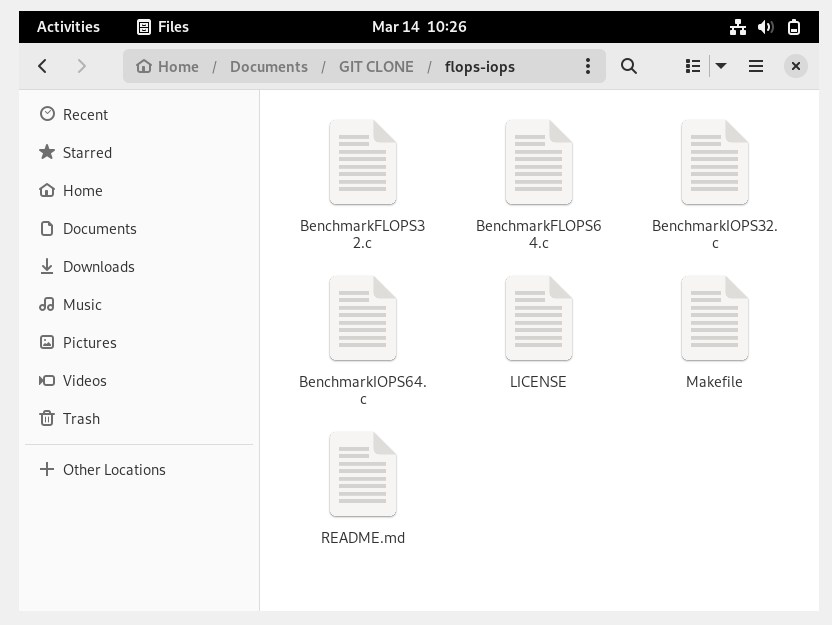

  <h1 class="text-align: center;font-weight: bold">Praktikum 3 Praktek System Operasi</h1>
  <h3 class="text-align: center;">Dosen Pengampu : Dr. Ferry Astika Saputra, S.T., M.Sc.</h3>

 

  
  

  <h3 style="text-align: center;">Disusun Oleh :</h3>
  

    <em>Muhammad Eko Nur Sholeh (3123500003)</em> 
    <em>Ghaly Abrarian Putra (3123500018)</em> 
    <em>Muhammad Rasyid Rafif (3122500030)</em>
  

<h3 style="text-align: center;line-height: 1.5">Politeknik Elektronika Negeri Surabaya Departemen Teknik Informatika Dan Komputer Program Studi Teknik Informatika 2023/2024</h3>
  

## Daftar Isi

1. [PPT](#ppt)
2. [FLOPS dan IOPS](#iops-dan-flops) 
   - [Install gcc](#instalasi-gcc) 
   - [Install make](#instalasi-make) 
   - [Install GIT](#instalasi-git) 
   - [Clone GIT flops&iops](#git-clone) 
   - [Tabel Pengujian](#tabel-pengujian) 
   - [Analisa](#analisa)
3. [Referensi](#referensi)

## PPT

**[Link PPT 🔗]([https://www.canva.com/design/DAF_WiIYVxg/RGJFWfZrDohJ6Ga9WcEA3g/edit](https://www.canva.com/design/DAF_XW_UZwk/Nu7KdnHiqvdVecegtiWBUQ/edit?utm_content=DAF_XW_UZwk&utm_campaign=designshare&utm_medium=link2&utm_source=sharebutton))**
            

### Instalasi GCC

1. **
Melakukan Instalasi Package GCC
**

 

     
   

Masuklah dalam mode root pada terminal dengan cara su - dan masukkan password user, kemudian masukan perintah "sudo apt install GCC" dan bila ada pertanyaan do you want to continue? "masukan Y" 

2. **
Instalasi GCC
**

 

     
   

   

     
   

Tunggu proses penginstallan GCC hingga selesai

3. **
Cek Versi GCC
**

 
   

     
   

Setelah proses intallasi selesai guna memastikan instalasi berhasil, maka kita bisa melakukan cek versi GCC dengan cara "gcc --version"

### <h1 align="center">Instalasi make<h1>

1. **
Melakukan Instalasi Make**

 

     
   

Masuklah dalam mode root pada terminal dengan cara su - dan masukkan password user, kemudian masukan perintah "sudo apt install make" dan Tunggu hingga install berhasil

2. **
Cek Versi Make
**
 

     
   

untuk memastikan keberhasilan instalasi make, kita bisa melakukan validasi cek versi, dengan cara "make --version"

### <h1 align="center">Instalasi GIT<h1>

1. **
Melakukan Instalasi GIT**

 

     
   

Masuklah dalam mode root pada terminal dengan cara su - dan masukkan password user, kemudian masukan perintah "sudo apt install git" dan bila muncul pertanyaan "Do you want to continue?" silahkan masukan Y

2. **
Download dan Install GIT**

 

     
   

setelah memasukan eksekusi Y, tunggu donwload & installasi git berjalan hingga selesai

3. **
Melakukan cek versi**

 

     
   

setelah memasukan  donwload & installasi git berjalan hingga selesai, untuk memastikan installasi berhasil kita bisa melakukan checking versi git dengan cara "git --version"

            
## <h1 align="center">Iops Dan Flops<h1>

<h2>Iops</h2>

IOPS adalah jumlah permintaan yang dikirim aplikasi Anda ke disk penyimpanan dalam satu detik.

<h3>Flops</h3>

FLOPS adalah singkatan dari istilah dalam bahasa Inggris Floating point Operations Per Second yang merujuk pada satuan untuk jumlah perhitungan yang dapat dilakukan oleh sebuah perangkat komputasi (dalam hal ini adalah komputer) terhadap bilangan pecahan (floating point) tiap satu satuan waktu.

<h2 align="center">Melakukan Benchmarking pada PC</h2>

#### GIT CLONE

1. **
Setelah melakukan instalasi GCC , GIT , MAKE**

 

     
   

Lakukan perintah "$ sudo apt update" pada terminal kemudian ketik "$ sudo apt install gcc" untuk menginstall compile dan "$ sudo apt install git" untuk menginstall git pada debian

**
2. Melakukan Git clone pada Debian 12**

 

     
   

Arahkan direktori pada terminal yang ingin dituju lalu ketik "$ git clone (paste link github) lalu tekan enter

**
3. Membuat Folder untuk tempat clone file**

Buka file manager layaknya di windows cari tempat untuk menampung folder dan buat foldernya serta open terminal

 

     
   

 

     
   

Kemudian lakukan perintah "git clone link_url_tujuan" pada terminal 

**
4. Melakukan Proses sebelum Benchmarking Iops dan Flops**

 

     
   

    

     
   

setelah file yang ada pada repository benchmark telah terclone pada folder, langkah berikutnya bisa langsung mengekskusi dengan "make" pada terminal folder flops-iops tadi

**
5. Implementasi make install**

setelah eksekusi make selanjutnya kita menginstall file benchmark yang telah kita clone tadi dengan perintah "sudo make install"

**
6. Benchmark  Flops**

setelah berhasil install menggunakan make instal pada file2 hasil clone selanjutnya kita bisa langsung mengetest score benchmark flops dengan cara menuliskan "flops64 $(nproc)"

**
7. Benchmark  Iops**

setelah berhasil install menggunakan make instal pada file2 hasil clone selanjutnya kita bisa langsung mengetest score benchmark iops dengan cara menuliskan "iops64 $(nproc)"

**ANALISA** 
<h2 align="center">Analisa Hasil Benchmarking</h2>

***TABEL PENGUJIAN*** 

|                      | IOPS64 (Integer)         | FLOPS64 (Floating Point)    |
|----------------------|------------------------|---------------------------|
| Total Throughput     | 11.376083 Gigaiops     | 12.1991997Gigaflops       |
| Single Core Throughput | 5.698112 Gigaiops   | 6.109621Gigaflops       |

Dengan melihat tabel di atas, Processor yang kita gunakan adalah ryzen 5 5600H dengan pembagian 2 core dapat dilihat bahwa IOPS memiliki total throughput dan throughput single core yang lebih tinggi dibandingkan dengan FLOPS. Namun demikian, perbedaan antara total throughput dan throughput single core juga penting untuk diperhatikan karena menunjukkan seberapa baik CPU dapat mengalokasikan dan memanfaatkan sumber daya secara efisien antara inti tunggal dan total throughput.

**REFERENSI** 

[MICROSOFT IOPS](https://learn.microsoft.com/id-id/azure/virtual-machines/premium-storage-performance)

[WIKIPEDIA FLOPS](https://id.wikipedia.org/wiki/FLOPS)
