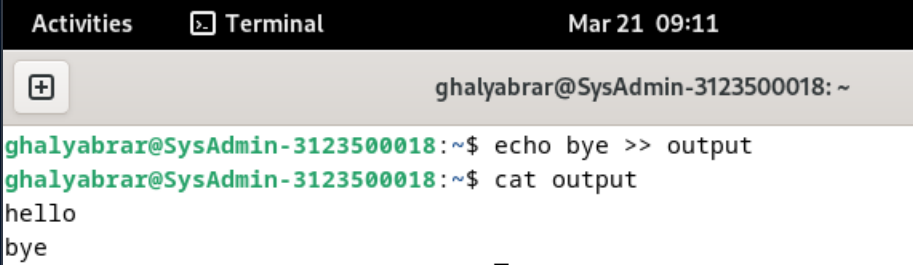
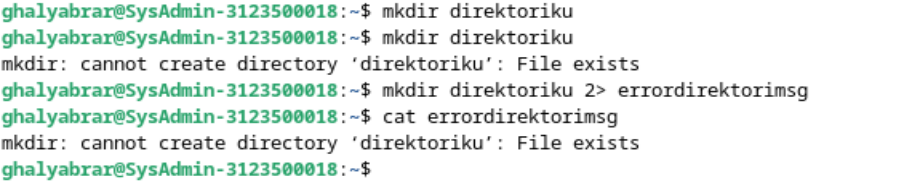

<div align="center">
  <h1 class="text-align: center;font-weight: bold">Praktikum 4<br>Praktek Operasi Input Output</h1>
  <h3 class="text-align: center;">Dosen Pengampu : Dr. Ferry Astika Saputra, S.T., M.Sc.</h3>
</div>
<br />
<div align="center">
  
  <div align="center">
  <h3 style="text-align: center;">Disusun Oleh :</h3>
  <p style="text-align: center;">
    <em>Muhammad Eko Nur Sholeh (3123500003)</em><br>
    <em>Ghaly Abrarian Putra (3123500018)</em><br>
    <em>Muhammad Rasyid Rafif (3122500030)</em>
  </p>
</div>

<h3 style="text-align: center;line-height: 1.5">Politeknik Elektronika Negeri Surabaya<br>Departemen Teknik Informatika Dan Komputer<br>Program Studi Teknik Informatika<br>2023/2024</h3>
  <hr><hr>
</div>
# Operasi Input Output

Referensi :
[Shell Programming](https://www.geeksforgeeks.org/introduction-linux-shell-shell-scripting/?ref=shm_)
[Shell Scripting For Beginners](https://www.youtube.com/watch?v=cQepf9fY6cE&list=PLS1QulWo1RIYmaxcEqw5JhK3b-6rgdWO_)

## POKOK BAHASAN:

```
* Pipeline
* Redirection
```

## TUJUAN PEMBELAJARAN:

Setelah mempelajari materi dalam bab ini, mahasiswa diharapkan mampu:

- Memahami konsep proses I/O dan redirection
- Memahami standar input, output dan error
- Menggunakan notasi output, append dan here document
- Memahami konsep _PIPE_ dan filter

## DASAR TEORI:

### 1. PROSES I/O

Sebuah proses memerlukan Input dan Output. Instruksi (command) yang diberikan pada Linux melalui Shell disebut sebagai eksekusi program yang selanjutnya disebut proses. Setiap kali instruksi diberikan, maka Linux kernel akan menciptakan sebuah proses dengan memberikan nomor PID (Process Identity). Proses dalam Linux selalu membutuhkan Input dan menghasilkan suatu Output.


Dalam konteks Linux input/output adalah :

- Keyboard (input)
- Layar (output)
- Files
- Struktur data kernel
- Peralatan I/O lainnya (misalnya Network)

## 2. FILE DESCRIPTOR

Linux berkomunikasi dengan file melalui file descriptor yang direpresentasikan melalui angka yang dimulai dari 0, 1, 2 dan seterusnya. Tiga buah file descriptor standar yang lalu diciptakan oleh proses adalah :

- 0 = keyboard (standar input)
- 1 = layar (standar output)
- 2 = layar (standar error)

Linux tidak membedakan antara peralatan hardware dan file. Linux memanipulasi peralatan hardware dengan memperlakukannya sama dengan ketika memperlakukan sebuah file.

## 3.PEMBELOKAN (REDIRECTION)

Pembelokan dilakukan untuk standard input, output dan error, yaitu untuk mengalihkan file descriptor dari 0, 1 dan 2. Simbol untuk pembelokan adalah :


## 4. PIPA (PIPELINE)

Mekanisme pipa digunakan sebagai alat komunikasi antar proses.


Proses-1 menghasilkan output yang selanjutnya digunakan sebagai input oleh Proses-2. Hubungan output input ini dinamakan `pipa ataiupipelining`, yang menghubungkan Proses-1 dengan Proses-2 dan dinyatakan dengan symbol “|”.

```
    Proses1 | Proses
```

## 5. FILTER

Filter adalah utilitas Linux yang dapat memproses standard input (dari keyboard) dan menampilkan hasilnya pada standard output (layar). Contoh filter adalah cat, sort, grep, pr, head, tail, paste dan lainnya.
Pada sebuah rangkaian pipa :

        P<sub>1</sub> | P<sub>2</sub> | P<sub>3</sub> ... | P<sub>n-1</sub> | P<sub>n</sub>

Maka P2 sampai dengan P<sub>n-1</sub> berfungsi sebagai filter. P1 (awal) dan Pn (terakhir) boleh tidak filter. Utilitas yang bukan filter misalnya who, ls, ps, lp, lpr, mail dan lainnya.
Beberapa perintah Linux yang digunakan untuk proses penyaringan antara lain :

- Perintah `grep`
  Digunakan untuk menyaring masukannya dan menampilkan baris-baris yang hanya mengandung pola yang ditentukan. Pola ini disebut regular expression.
- Perintah `wc`
  Digunakan untuk menghitung jumlah baris, kata dan karakter dari baris-baris masukan yang diberikan kepadanya. Untuk mengetahui berapa baris gunakan option –l, untuk mengetahui berapa kata, gunakan option –w dan untuk mengetahui berapa karakter, gunakan option –c.
  Jika salah satu option tidak digunakan, maka tampilannya adalah jumlah baris, jumlah kata dan jumlah karakter.
- Perintah `sort`
  Digunakan untuk mengurutkan masukannya berdasarkan urutan nomor ASCII dari karakter.
- Perintah `cut`
  Digunakan untuk mengambil kolom tertentu dari baris-baris masukannya, yang ditentukan pada option –c.
- Perintah `uniq`
  Digunakan untuk menghilangkan baris-baris berurutan yang mengalami duplikasi, biasanya digabungkan dalam pipeline dengan `sort`.

## TUGAS PENDAHULUAN:

## Jawablah pertanyaan-pertanyaan di bawah ini :

1. Apa yang dimaksud redirection?
   - Redirection mengacu pada teknik untuk mengalihkan aliran input dan output dari suatu program. Dengan redirection, Anda dapat mengalihkan output dari sebuah perintah agar disimpan dalam file atau menggunakan output tersebut sebagai masukan untuk perintah lainnya.
2. Apa yang dimaksud pipeline?
   - Pipeline adalah mekanisme yang memungkinkan output dari satu perintah (program) digunakan sebagai input untuk perintah lainnya secara langsung, tanpa perlu menyimpan output ke dalam file terlebih dahulu.
3. Apa yang dimaksud perintah di bawah ini :
   echo, cat, more, sort, grep, wc, cut, uniq
   - `echo` digunakan untuk mencetak atau menampilkan teks atau variabel ke terminal atau ke output standar.
   - `cat` digunakan untuk mencantumkan, menggabungkan, dan menulis konten atau isi file dalam output standar
   - `more` untuk Melihat isi suatu file dengan fasilitas melihat isi file dari atas dan untuk kebawah menggunakan tombol Enter untuk perbaris dan tombol Spasi untuk perlayar
   - `sort` Digunakan untuk mengurutkan masukannya berdasarkan urutan nomor ASCII dari karakter.
   - `grep` Digunakan untuk menyaring masukannya dan menampilkan baris-baris yang hanya mengandung pola yang ditentukan. Pola ini disebut regular expression.
   - `wc` Digunakan untuk menghitung jumlah baris, kata dan karakter dari baris-baris masukan yang diberikan kepadanya.
   - `cut` Digunakan untuk mengambil kolom tertentu dari baris-baris masukannya, yang ditentukan pada option –c.
   - `uniq` Digunakan untuk menghilangkan baris-baris berurutan yang mengalami duplikasi, biasanya digabungkan dalam pipeline dengan `sort`.

## PERCOBAAN:

1. Login sebagai user.
2. Bukalah Console Terminal dan lakukan percobaan-percobaan di bawah ini. Perhatikan hasil setiap percobaan.
3. Selesaikan soal-soal latihan.

## Percobaan 1 : File descriptor

1. Output ke layar (standar output), input dari system (kernel)

   ```
   $ ps
   ```

   Hasil Output

   

   Analisa :
   menampilkan standart output ke layar dari input system kernel,
   PID: Ini adalah pengidentifikasi proses unik.
   TTY: Ini adalah terminal yang terkait dengan proses.
   TIME: Ini adalah waktu CPU yang telah digunakan oleh proses.
   CMD: Ini adalah perintah yang digunakan untuk memulai proses.  
   <br>

2. Output ke layar (standar output), input dari keyboard (standard input)

   ```
    $ cat
    hallo, apa khabar
    hallo, apa khabar
    exit dengan ^d
    exit dengan ^d
    [Ctrl-d]
   ```

   Hasil Output

   

   Analisa :
   Manampilkan standart output ke layar dari input keyboard, menggunakan perintah cat untuk input dari keyboard dan ketika telah menginputkan sebuah teks akan dikembalikan berupa teks yang telah diinputkan.
   <br>

3. Input nama direktori, output tidak ada (membuat direktori baru), bila terjadi error maka tampilan error pada layar (standard error)

   ```
   $ mkdir mydir
   $ mkdir mydir **(Terdapat pesan error)**
   ```

   Hasil Output

   

   Analisa :
   Membuat direktori baru menggunakan perintah mkdir (nama direktori),ketika nama direktori telah ada maka akan muncul standart error ke yang ditampilkan ke layar
   <br>

## Percobaan 2 : Pembelokan (redirection)

1. Pembelokan standar output

   ```
    $ cat 1> myfile.txt
    Ini adalah teks yang saya simpan ke file myfile.txt
   ```

   Hasil Output

   

   Analisa :
   Membelokan standart output menggunakan 1> dimana mengisikan sebuah teks ke dalam myfile.txt dengan perintah cat.
   <br>

2. Pembelokan standar input, yaitu input dibelokkan dari keyboard menjadi dari file

   ```
    $ cat 0< myfile.txt
    $ cat myfile.txt
   ```

   Hasil Output

   

   Analisa :
   membelokkan standart input 0< yang telah diinputkan tadi ke dalam myfile.txt dan menampilkan standart output ke layar menggunakan perintah cat myfile.txt
   <br>

3. Pembelokan standar error untuk disimpan di file

   ```
    $ mkdir mydir (Terdapat pesan error)
    $ mkdir mydir 2> myerror.txt
    $ cat myerror.txt
   ```

   Hasil Output

   

   Analisa :
   membelokkan standart error ketika membuat direktori dan memasukkan teks error tersebut ka dalam file myerror.txt dengan cara memanggil error lalu dibelokkan ke file myerror.txt,seperti perintah mkdir mydir karena direktori telah ada maka akan muncul error dan menambahkan perintah 2> myerror.txt yang berfungsi untuk mamasukkan teks error ke dalam file myerror.txt
   <br>

4. Notasi 2>&1 : pembelokan standar error (2>) adalah identik dengan file descriptor 1.

   ```
    $ ls filebaru (Terdapat pesan error)
    $ ls filebaru 2> out.txt
    $ cat out.txt
    $ ls filebaru 2> out.txt 2>&
    $ cat out.txt
   ```

   Hasil Output

   

   Analisa :
   membelokkan error seperti percobaan sebelumnya menggunakan 2>&1 dan membelokkan standart error ke dalam file out.txt
   <br>

5. Notasi 1>&2 (atau >&2) : pembelokan standar output adalah sama dengan file descriptor 2 yaitu standar error

   ```
   $ echo “mencoba menulis file” 1> baru
   $ cat filebaru 2> baru 1>&
   $ cat baru
   ```

   Hasil Output

   

6. Notasi >> (append)

   ```
   $ echo “kata pertama” > surat
   $ echo “kata kedua” >> surat
   $ echo “kata ketiga” >> surat
   $ cat surat
   $ echo “kata keempat” > surat
   $ cat surat
   ```

   Hasil Output

   

   Analisa :
   meninputkan teks menggunakan perintah echo dan mengirimkan teks tersebut ke surat,untuk mengakhiri input teks menggunakan notasi >> (append)
   <br>

7. Notasi here document (<<++ .... ++) digunakan sebagai pembatas input dari keyboard. Perhatikan bahwa tanda pembatas dapat digantikan dengan tanda apa saja, namun harus sama dan tanda penutup harus diberikan pada awal baris

   ```
   $ cat <<++
   Hallo, apa kabar?
   Baik-baik saja?
   Ok!
   ++
   $ cat <<%%%
   Hallo, apa kabar?
   Baik-baik saja?
   Ok!
   %%%
   ```

   Hasil Output

   

   Analisa :
   Meningputkan sebuakn teks dengan perintah cat <<++ dan cat <<%%% dan ketika selesai input harus memberi batasan sama seperti perintah contoh ++ dan %%%
   <br>

8. Notasi – (input keyboard) adalah representan input dari keyboard. Artinya menampilkan file 1, kemudian menampilkan input dari keyboard dan menampilkan file 2. Perhatikan bahwa notasi “-“ berarti menyelipkan input dari keyboard

```
$ cat myfile.txt – surat
```


Analisa :
menampilakan input dari keyboard yang ditulis ke dalam file myfile.txt

## Percobaan 3 : Pipa (pipeline)

1. Operator pipa (|) digunakan untuk membuat eksekusi proses dengan melewati data langsung ke data lainnya.

   ```
   $ who
   $ who | sort
   $ who | sort –r
   $ who > tmp
   $ sort tmp
   $ rm tmp
   $ ls –l /etc | more
   $ ls –l /etc | sort | more
   ```

   Hasil Output

   

   

   Analisa :
   terdapat berbagai perintah yang dijalankan,perintah who digunakan untuk menampilkan informasi tentang user,perintah sort digunakan untuk mengurutkan sesuai nama/abjad,perintah more digunakan untuk menampilkan isi file secara per halaman.
   <br>

2. Untuk membelokkan standart output ke file, digunakan operator ">"

   ```
   $ echo hello
   $ echo hello > output
   $ cat output
   ```

   Hasil Output

   

   Analisa :
   Pada perintah diatas memasukan input dari keyboard yang dituju ke file hello lalu dibelokkan ke file output dengan menggunakan operator >,serta menampilkan isi dari output menggunakan perintah cat.
   <br>

3. Untuk menambahkan output ke file digunakan operator ">>"

   ```
   $ echo bye >> output
   $ cat output
   ```

   Hasil Output

   

   Analisa :
   Sama seperti diatas, namun operator >> dapat langsung digunakan untuk menambahkan output ke file.
   <br>

4. Untuk membelokkan standart input digunakan operator "<"

   ```
   $ cat < output
   ```

   Hasil Output

   

   Analisa :
   pada perintah menggunakan operator < yaitu membelokkan standart input lalu mencetakknya ke layar.
   <br>

5. Pembelokan standart input dan standart output dapat dikombinasikan tetapi tidak boleh menggunakan nama file yang sama sebagai standart input dan output.

   ```
   $ cat < output > out
   $ cat out
   $ cat < output >> out
   $ cat out
   $ cat < output > output
   $ cat output
   $ cat < out >> out (Proses tidak berhenti)
   [Ctrl-c]
   $ cat out
   ```

   Hasil Output

   

   Analisa :
   cat < output > out digunakan untuk membaca input dari file output dan menuliskannya kembali ke file baru bernama out. perintah cat out digunakan untuk menampilkan isi file out ke layar,perintah cat < out >> out digunakan untuk menimpa isi file out dengan isi dari dirinya sendiri.

## Percobaan 4 : Filter

1. Pipa juga digunakan untuk mengkombinasikan utilitas sistem untuk membentuk fungsi yang lebih kompleks

   ```
    $ w –h | grep <user>
    $ grep <user> /etc/passwd
    $ ls /etc | wc
    $ ls /etc | wc –l
    $ cat > kelas1.txt
    Badu
    Zulkifli
    Yulizir
    Yudi
    Ade
    [Ctrl-d]
    $ cat > kelas2.txt
    Budi
    Gama
    Asep
    Muchlis
    [Ctrl-d]
    $ cat kelas1.txt kelas2.txt | sort
    $ cat kelas1.txt kelas2.txt > kelas.txt
    $ cat kelas.txt | sort | uniq
   ```

   Hasil Output

   

## LATIHAN:

1. Lihat daftar secara lengkap pada direktori aktif, belokkan tampilan standard output ke file baru.

   Hasil Output

   

2. Lihat daftar secara lengkap pada direktori /etc/passwd, belokkan tampilan standard output ke file baru tanpa menghapus file baru sebelumnya.

   Hasil Output

   

3. Urutkan file baru dengan cara membelokkan standard input.

   Hasil Output

   

4. Urutkan file baru dengan cara membelokkan standard input dan standard output ke file baru.urut.

   Hasil Output

   

5. Buatlah direktori latihan 2 sebanyak 2 kali dan belokkan standard error ke file rmdirerror.txt.

   Hasil Output

   

6. Urutkan kalimat berikut :

   ```
   Jakarta
   Bandung
   Surabaya
   Padang
   Palembang
   Lampung
   ```

   Dengan menggunakan notasi **here document (<@@@ ...@@@)** . [HINT](https://www.geeksforgeeks.org/how-to-use-here-document-in-bash-programming/)

   Hasil Output

   

7. Hitung jumlah baris, kata dan karakter dari file baru.urut dengan menggunakan filter dan tambahkan data tersebut ke file baru.

   Hasil Output

   

8. Gunakan perintah di bawah ini dan perhatikan hasilnya.

   ```
    $ cat > hello.txt
    dog cat
    cat duck
    dog chicken
    chicken duck
    chicken cat
    dog duck
    [Ctrl-d]
    $ cat hello.txt | sort | uniq
    $ cat hello.txt | grep “dog” | grep –v “cat”
   ```

   Hasil Output

   

## LAPORAN RESMI:

1. Analisa hasil percobaan 1 sampai dengan 4, untuk setiap perintah jelaskan tampilannya.
2. Kerjakan latihan diatas dan analisa hasilnya
3. Berikan kesimpulan dari praktikum ini.
