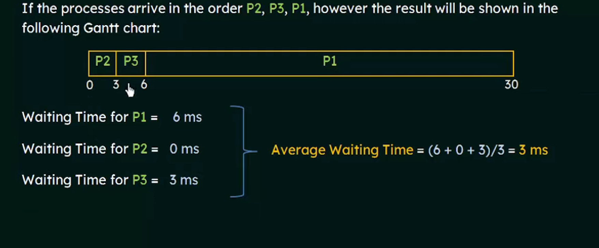
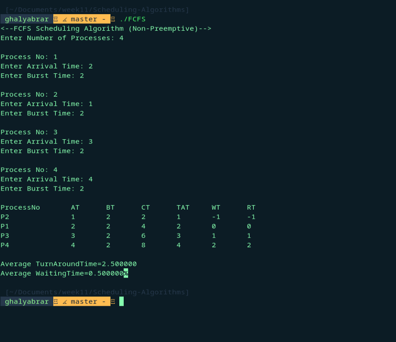
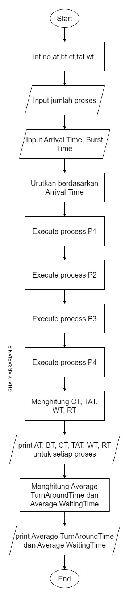
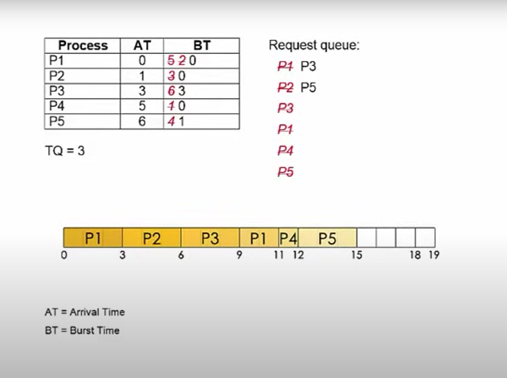
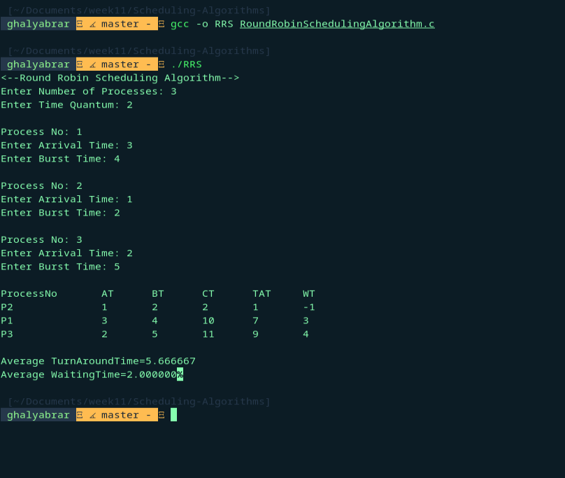
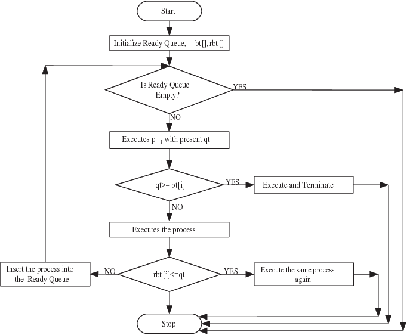
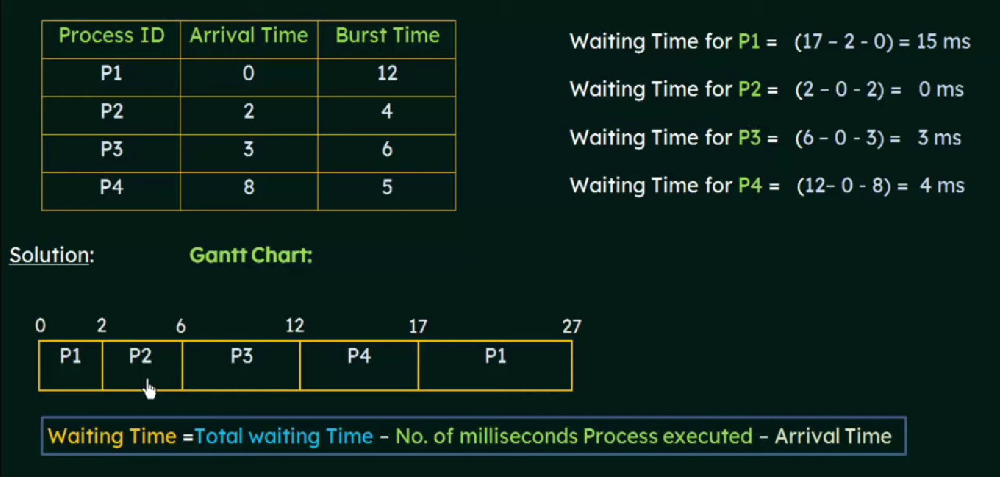
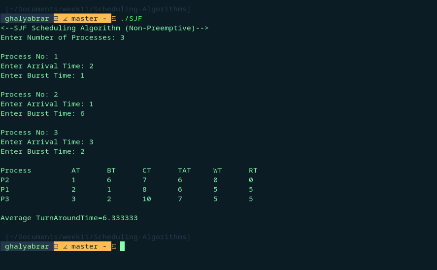
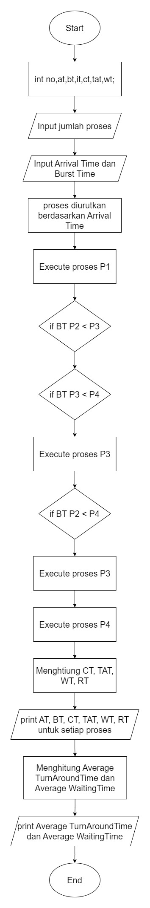

  <h1 class="text-align: center;font-weight: bold">Praktikum 11 Praktek System Operasi</h1>
  <h3 class="text-align: center;">Dosen Pengampu : Dr. Ferry Astika Saputra, S.T., M.Sc.</h3>

 

  
  

  <h3 style="text-align: center;">Disusun Oleh :</h3>
  

    <em>Muhammad Eko Nur Sholeh (3123500003)</em> 
    <em>Ghaly Abrarian Putra (3123500018)</em> 
    <em>Muhammad Rasyid Rafif (3122500030)</em>
  

<h3 style="text-align: center;line-height: 1.5">Politeknik Elektronika Negeri Surabaya Departemen Teknik Informatika Dan Komputer Program Studi Teknik Informatika 2023/2024</h3>
  

## Scheduling Algorithm

#### First-Come First-Serve Algorithm

##### Contoh perhitungan secara teori :

##### Hasil running

##### Flowchart

##### Analisa

Berdasarkan gambar hasil percobaan di atas, dapat disimpulkan bahwa Algoritma First-Come First-Serve telah berfungsi sesuai dengan teori. Algoritma ini bekerja dengan prinsip antrian, di mana proses yang datang pertama (waktu kedatangan paling awal) akan dijalankan terlebih dahulu, kemudian proses berikutnya dijalankan setelah proses sebelumnya selesai, dan seterusnya seperti dalam konsep antrian. Konsep antrian yang dimaksud adalah proses yang datang lebih awal dilayani terlebih dahulu, sehingga semua proses berjalan secara berurutan.

#### Round Robin Algorithm

##### Contoh perhitungan secara teori :

##### Hasil running

##### Flowchart

##### Analisa

Algoritma Round Robin beroperasi dengan menggunakan time quantum, yang pada dasarnya adalah batas waktu bagi sebuah proses untuk berjalan. Jika burst time suatu proses lebih kecil dari time quantum, proses tersebut akan berjalan selama burst time. Jika burst time suatu proses lebih besar dari time quantum, proses tersebut akan berjalan selama time quantum, dan burst time akan diperbarui menjadi sisa burst time setelah berjalan selama time quantum (Burst time - Quantum time = Sisa Burst Time), lalu proses tersebut akan dikembalikan ke ready queue. Proses ini terus berlanjut hingga semua proses selesai. Pada percobaan di atas, detail output dari queue menunjukkan urutan proses berjalan, dimulai dari P1 -> P2 -> P1 -> P3 -> P2 -> P1.

#### Shortest Job First Algorithm

##### Contoh perhitungan secara teori :

##### Hasil running

##### Flowchart

##### Analisa

Algoritma Shortest Job First bekerja dengan memprioritaskan proses yang memiliki burst time paling pendek, sambil mempertimbangkan arrival time. Proses yang pertama datang akan dieksekusi sampai selesai terlebih dahulu. Kemudian, proses yang ada di ready queue akan dibandingkan untuk menentukan mana yang memiliki burst time paling singkat, dan proses tersebut yang akan dieksekusi selanjutnya. Jika ada beberapa proses dengan burst time yang sama, maka proses dengan arrival time lebih awal (yang datang lebih dulu) akan diprioritaskan.
