<!-- JUDUL -->

  <h1 style="text-align: center; font-weight: bold">Praktikum 1 Praktek System Operasi</h1>
  <h3 style="text-align: center;">Dosen Pengampu : Dr. Ferry Astika Saputra, S.T., M.Sc.</h3>

 
<!-- END JUDUL -->

<!-- LOGO -->

  

<!-- END LOGO -->

<!-- MEMBER -->

  <h3 style="text-align: center;">Disusun Oleh :</h3>
  

    <em>Muhammad Eko Nur Sholeh (3123500003)</em> 
    <em>Ghaly Abrarian Putra (3123500018)</em> 
    <em>Muhammad Rasyid Rafif (3122500030)</em>
  

<!-- END MEMBER -->

<!-- K -->

  <h3 style="line-height: 1.3; font-weight: 600;">Politeknik Elektronika Negeri Surabaya Departemen Teknik Informatika Dan Komputer Program Studi Teknik Informatika 2023/2024</h3>
  

<!-- END K -->

<!-- DAFTAR ISI -->

  
## Daftar isi

1. [Daftar Isi](#daftar-isi)
2. [Pendahuluan](#pendahuluan)
3. [Sistematis Booting](#proses-booting)
4. [Soal Praktikum](#soal)
5. [Instalasi](#instalasi)
   - [Instalasi Virtual Machine](#instalasi-virtual-machine)
   - [Instalasi Debian 12 pada Virtual Machine](#instal-os)
6. [Kesimpulan](#kesimpulan)
7. [Refrensi](#referensi)

<!-- END DAFTAR ISI -->

<!-- KONTEN -->

### Pendahuluan

**Sistem Operasi** adalah perangkat lunak yang mengatur dan mengelola semua operasi dasar komputer, seperti menjalankan program, mengelola memori, dan menyediakan antarmuka pengguna. Ini merupakan fondasi dari pengoperasian setiap perangkat komputer modern.

### Proses Booting

**Proses booting** merupakan serangkaian tahap yang dilakukan sebuah perangkat elektronik saat pertama kali dinyalakan setelah mati total, pada tahap proses booting berlangsung perangkat akan mempersiapkan inisialisasi serta konfigurasi hardware juga mempersiapkan perangkat lunak (OS) yang akan di Jalankan.

Berikut merupakan langkah - langkah pada saat proses booting :

1. _Power On_ : perangkat mengirim tegangan maupun sinyal pada seluruh komponen hardware yang terkait.
2. _Post (Power-On Self-Test)_ : Perangkat akan melakukan testing awal pada perangkat kerasnya, di komputer mencakup processor ,ram , gpu , dan storage yang tertanam. biasanya tahap ini ditandai pada saat muncul logo produsen motherboardnya.
3. _Inisialisasi_ : Setelah tahap POST dan masuk kedalam boot priority, komputer akan melakukan inisialisasi perangkat keras eksternal. (Keyboard, Mouse , Printer , Headseat , Monitor ,Kabel Lan )
4. _Loading Bootloader_ : bootloader merupakan sebuah proses dimana ketika storage penyimpanan memulai sebuah sistem operasi ke dalam memori (RAM).
5. _Loading Kernel_ : merupakan sebuah tahap dimana sistem operasi secara aktif mulai memasuki tahap berikutnya (inisialisai sistem)
6. _Init porcess_ : setelah kernel dimuat, sistem opereasi akan melakukan insialisasi. memuat layanan siste, mengatur konfigurasi jaringan, mempersiapkan environment user.
7. _User Login_ : tahap terakhir, pengguna diminta untuk melakukan login ke sistem.
8. _GUI_ : render tampilan antarmuka grafis serta masuk kedalam sistem.

### SOAL

laporankan hasil pengerjaan sebuah instalisasi debian 12 menggunakan virtual machine (VMbox) dengan syarat :

- Setting CPU usage : 2 Core
- Setting Ram : 4096MB / 4GB
- HDD 25GB dengan partisi :
  / : 20GB
  /storage : 5GB
  /swap :1.5GB

### Instalasi

##### Instalasi Virtual Machine

1. Kunjungi website resmi Virtual Box (https://www.virtualbox.org/wiki/Downloads)

   

     
   

2. Pilih versi VM packages yang sesuai dengan OS yang sekarang dijalankan dan tekan versi maka file Virtual box akan otomatis ter-download.

   

     
   

3. Tunggu Download file hingga selesai.

   

     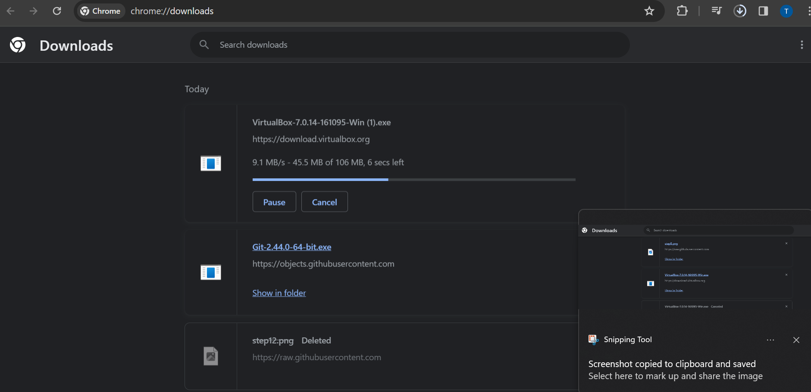
   

4. Buka File Aplikasi VirtualBox.exe (pada windows) yang telah didownload tadi

   

     
   

5. Setelah aplikasi telah terbuka bisa Klik **"Next"**

   

     
   

6. Setup instalasi & Klik **"Next"**

   

     
   

7. Pada tahap warning network interface Klik **"YES"**

   

     
   

8. Pada tahap missing dependencies klik **"YES"**

   

     
   

9. Pada tahap siap install Klik **"Instal"**

   

     
   

10. Tunggu proses intalasi aplikasi hingga **selesai**

    

      
    

11. Setelah proses install selesai centang pada 'Start Virtual machine'

    

      
    

### instalasi os

1. Download ISO debian 12 pada (https://www.debian.org/download)
   

2. Masuk dalam tampilan virtual box dan klik **"New"**
   
3. Masukan name "BEBAS" (Debian12) Sesuaikan Type dan versi Debian sesuai arsitektur CPU kemudian Klik **"Next"**
   

4. **Alokasikan** Cpu & Ram Usage sesuai arahan (4096MB RAM & 2 CORE CPU)
   

5. **Alokasikan** Storage 25GB (Akan otomatis generate 26gb) dan klik **"NEXT"**
   

6. Pada summary / preview silahkan klik **"finish"**
   

7. Pada tampilan utama arahkan serta klik tools yang sudah dibuat dan klik **"setting"**
   

8. Pada general ubah shared **Clipboard** menjadi bidirectional
   

9. Pada Display atur video memory sebaik mungkin, bila akan membutuhkan rendering yang cukup berat maka opsi paling maksimal adalah yang terbaik
   

10. Pada Storage > Empty > Silahkan cari iso yang telah Didownload
    

11. Cari iso yang telah didownload serta klik open
    

12. Setelah menyeting, silahkan kembali ke halaman utama dan Klik **"Start"**
    

13. Setelah terbuka silahkan enter pada **Grapich Install**
    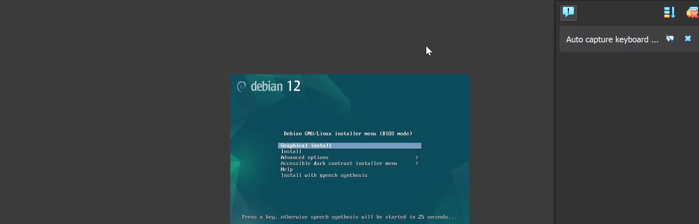

14. Pilih bahasa yang di inginkan dan Klik **Continue**
    

15. Pilih Lokasi yang di inginkan (bisa yang terdekat dengan kalian) dan Klik **Continue**
    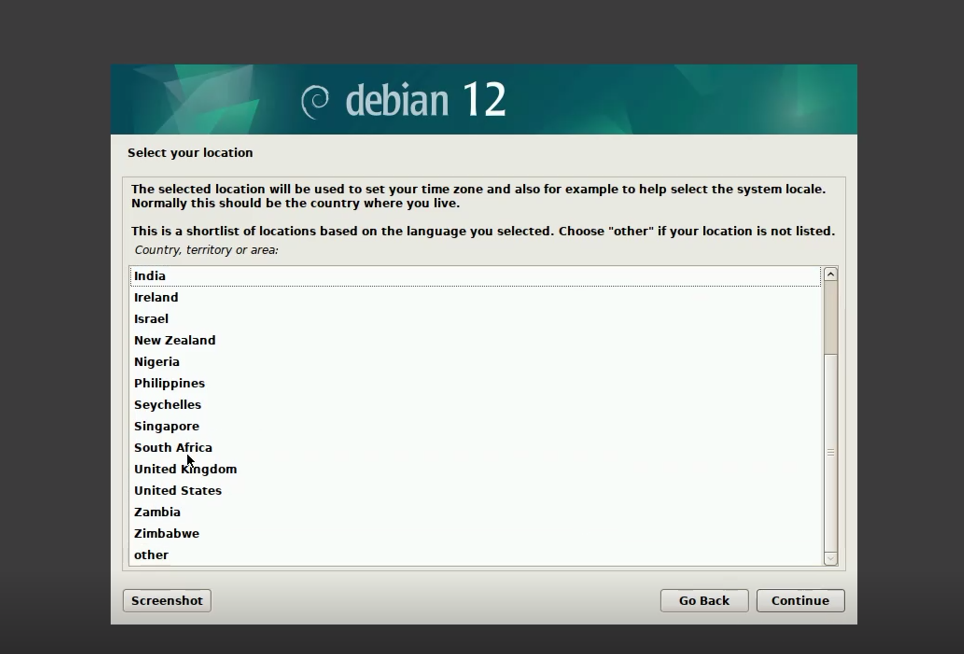

16. Pilih Layout keyboard yang di inginkan dan Klik **Continue**
    

17. Silahkan tunggu proses-proses persiapannya
    

18. Masukan hostname sesuai saran Administrator Protocol dan Klik **Continue**
    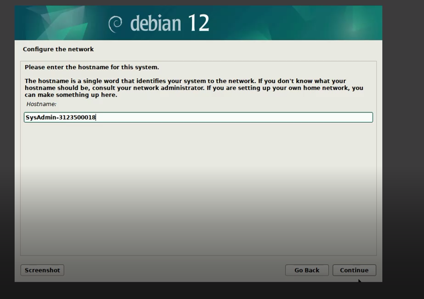

19. Masukan Password sesuai keinginan dan Klik **Continue**
    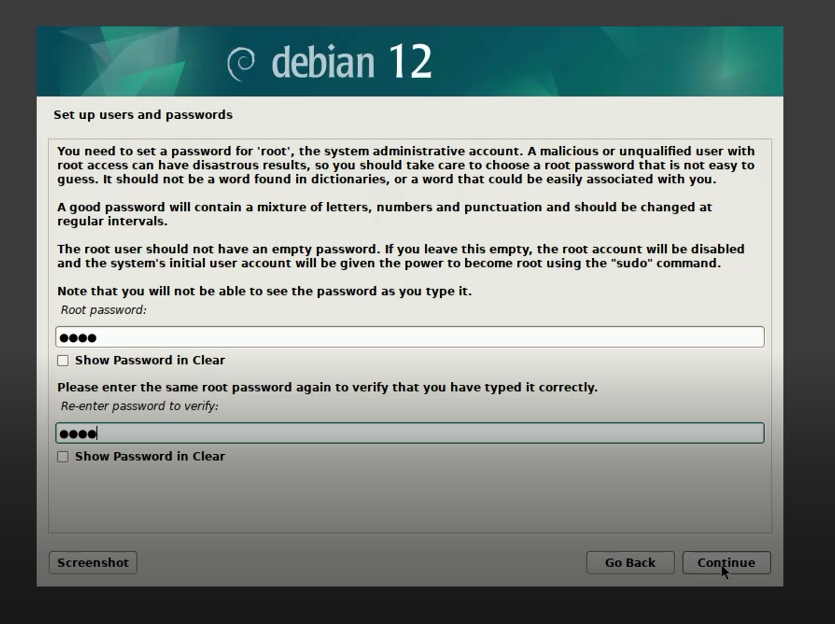

20. Masukan User account sesuai keinginan dan Klik **Continue** dan tunggu proses-prosesnya
    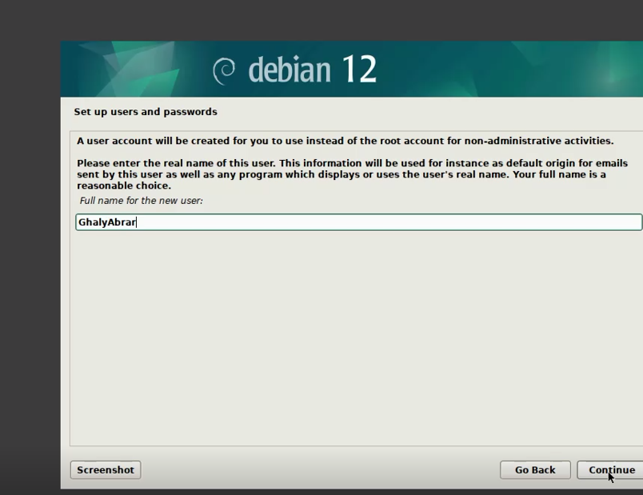

21. Pilih Partisi disk yang sudah dibuat dan ditetapkan diawal langkah tadi dan Klik **Continue**
    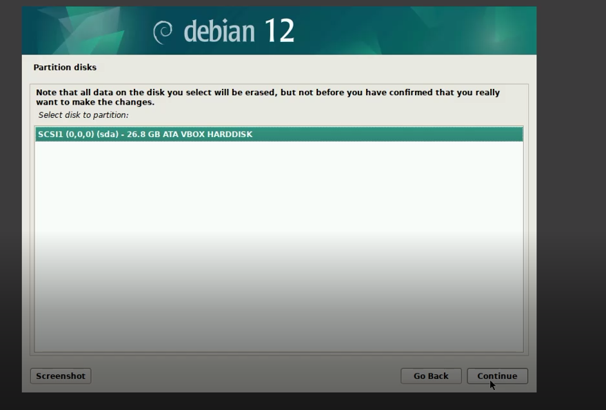

22. Pilih all files in one partisi.
    

23. Partisi untuk di pisah-pisah.
    

24. Pilih Primary, untuk / dan Klik **Continue**
    

25. Masukan sesuai arahan yaitu / (20GB) dan klik **Continue**
    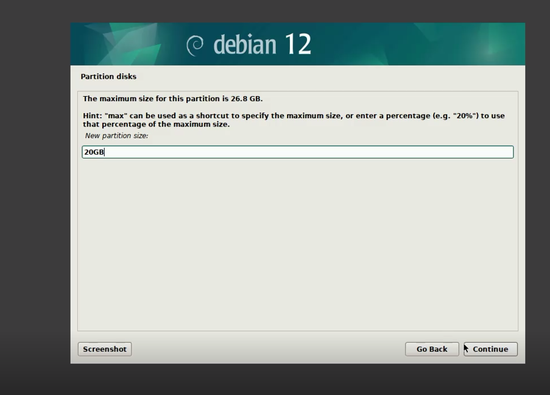

26. Pilih Ext4 & karna sudah GRUB sehingga tidak perlu bootflag ON, untuk / dan Klik **Continue**
    

27. Kemudian klik aja langsung bagian done setting up the partition dan Klik **Continue**
    

28. Lakukan hal berulang dengan pilih partisi yang belum dibagi dan Klik **Continue**
    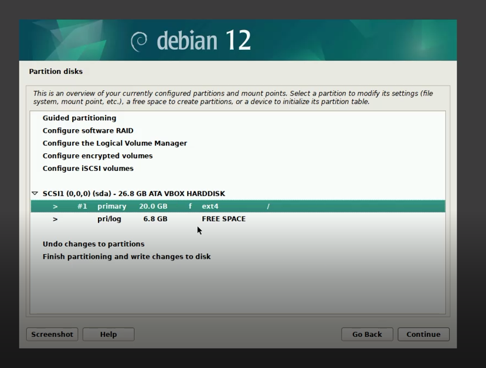

29. Lalu klik crete a new partition dan Klik **Continue**
    

30. Masukan size sebesar 5GB untuk /Storage dan klik **Continue**
    

31. Pilih Primary untuk /Storage dan klik **Continue**
    

32. Pilih beginning dan klik **Continue**
    

33. Gunakan ext4 dan jangan lupa ubah Mount point dengan cara enter manually menjadi /Storage dan Klik **Continue**
    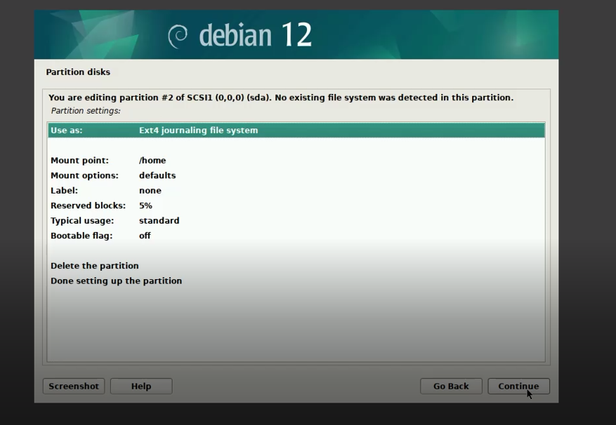

34. Pilih lagi dengan paritisi yang belum di inisialisasi
    

35. Lalu klik crete a new partition dan Klik **Continue**
    

36. Masukan size partisi sebesar 1.5GB untuk SWAP dan klik **Continue**
    

37. Plih Logical dan Klik **Continue**
    

38. Pilih beginning dan klik **Continue**
    

39. Pilihlah use As klik **Continue**
    

40. Pada use As gantilah menjadi SWAP dan klik **Continue**
    

41. Kemudian klik aja langsung bagian done setting up the partition dan Klik **Continue**
    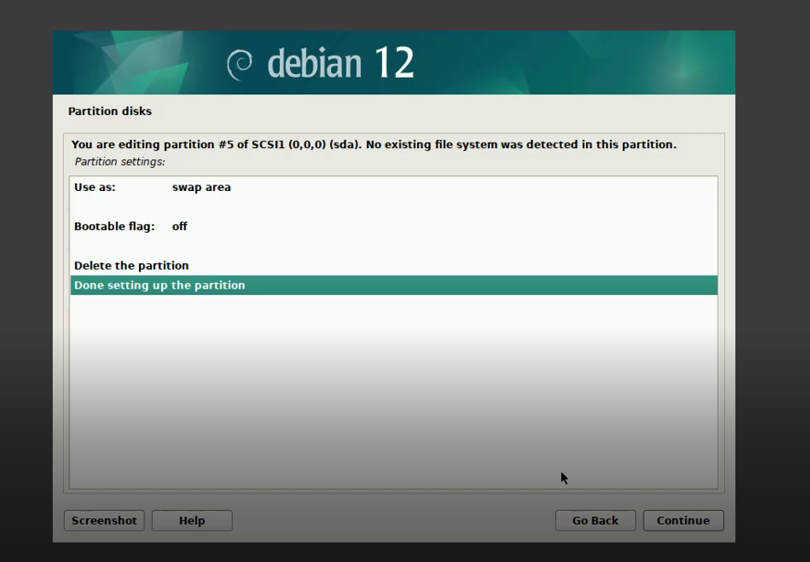

42. Jika sudah silahkan pilih finish partisioning dan Klik **Continue**
    

43. Pilih yes dan Klik **continue** pada pertanyaan write the change to disk.
    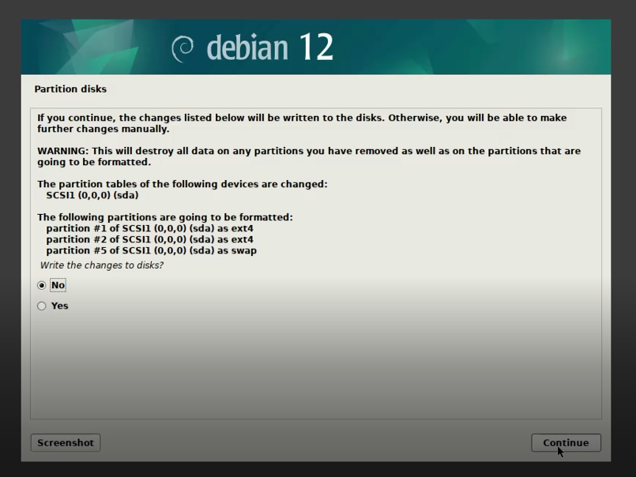

44. Pilih No pada scan Extra installation media
    

45. Pilih Configure the package manager country ke negara "Indonesia" dan Klik **continue**
    

46. Pilih Debian archive mirror ke Kebo.pens.ac.id dan Klik **continue**
    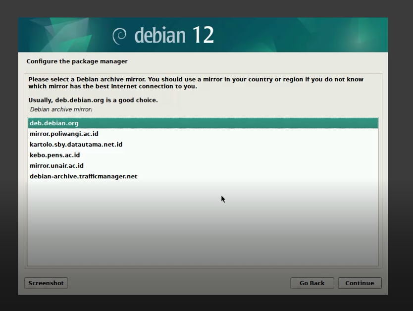

47. Kosongkan bagian http proxy dan Klik **continue**
    

48. Pada tahap configuring popularity pilih NO dan Klik **continue**
    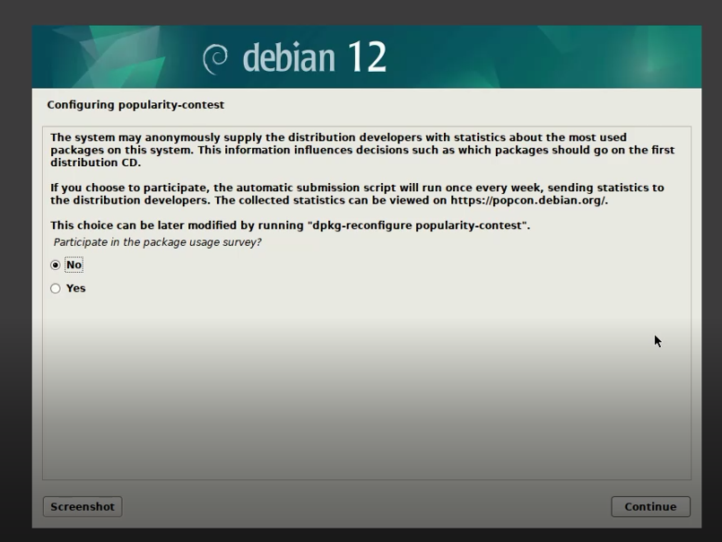

49. Tunggu Proses Installasi
    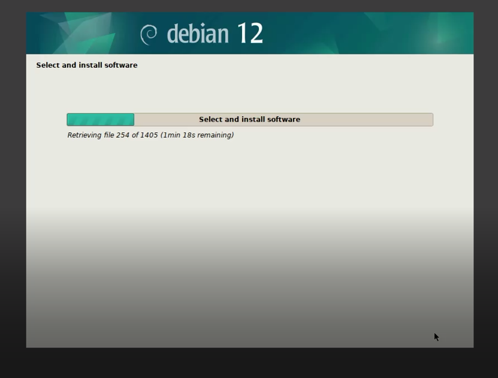

50. Pilih yes pada pertanyaan apakah install GRUB dan Klik **Continue**
    

51. Tunggu Installasi GRUB hingga selesai
    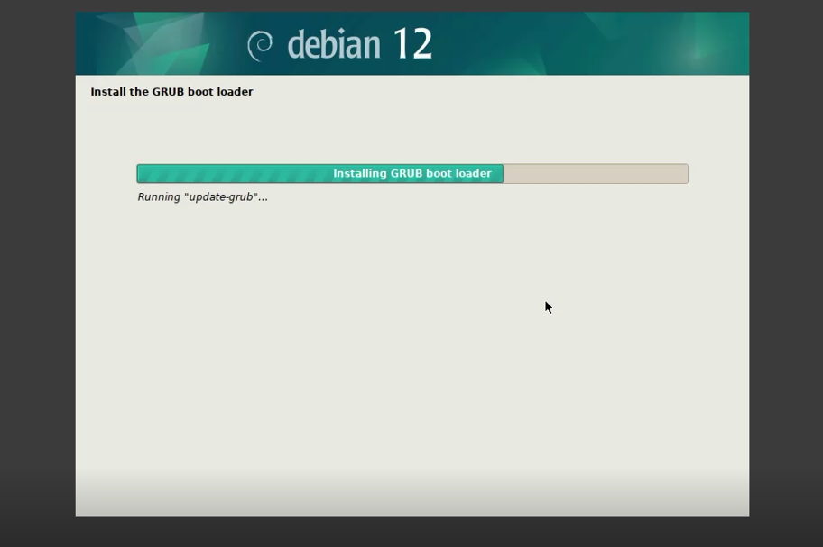

52. Pilihlah bootloader GRUB pada device awal yang tadi kita buat.
    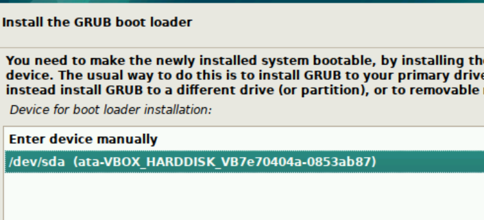
53. Pada Permintaan reboot silahkan klik **Continue**
    

54. Dan Akhirnya OS linux debian kita siap digunakan!
    

## Kesimpulan

setelah praktikum Percobaan instal debian pada virtualbox menjadikan mahasiswa paham bagaimana cara menginstall OS pada VM (Virtual Machine) & Memberikan wawasan tentang konsep sederhana jalannya Operating Sistem selain itu, hal yang menarik ialah OS dapat berjalan tanpa harus menjadi Boot prioritas pada suatu BIOS / UEFI tapi OS juga dapat berjalan dan dijalankan pada Virtual Machine, sebagai Contoh adalah Oracle Virtualbox ini, bisa menjalankan Debian. mungkin bila di Machintos (MacOS) ada windows Pararel yang dapat menjalankan OS windows pada macbook / iMac dengan menggunakan Virtual Machine. sehingga dapat kita simpulkan bersama pada intinya OS adalah suatu perangkat lunak yang sangat penting pada keberlangsungan fungsi suatu barang elektronik tidak terkecuali sedikitpun.

### Referensi

Buku 'Operating System Concepts' [🔗](https://os.ecci.ucr.ac.cr/slides/Abraham-Silberschatz-Operating-System-Concepts-10th-2018.pdf)

Mengenal debian oleh telkom university [🔗](https://it.telkomuniversity.ac.id/mengenal-debian-os-sejarah-kelebihan-dan-kekurangan/)

Apa itu Virtual Box oleh jagongoding[🔗](https://jagongoding.com/others/apa-itu-virtual-box/)

Install virtual box oleh solmet kemendikbud [🔗](https://solmet.kemdikbud.go.id/?p=2660)

Link Download Debian [🔗](https://www.debian.org/download)

Link Virtual Box[🔗](https://www.virtualbox.org/)

Video Tutorail How to Download & Instal debian 12 on VirtualBox[🔗](https://www.youtube.com/watch?v=zfOWKG2QPB0)

